# 기술스택 및 SW 아키텍처

> 4 클라이언트(User 웹 + iOS + Android + Admin 웹) + 단일 백엔드 구조
>
> 작성일: 2026-05-27

---

## 0. 개발 순서 전략

**웹 우선 → 개발자 내부 검증 → AI 포팅으로 모바일 전환 → 스토어 출시**

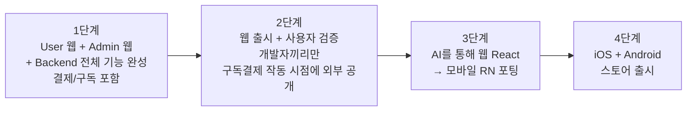

### 0.1 핵심 원칙
- **모바일은 처음부터 안 만든다**. 웹을 먼저 완성하고 검증한 뒤, AI(Claude 등)를 활용해 React + RN 코드 유사성을 살려 포팅.
- **웹 출시 후 사용자 검증은 개발자끼리만**. 외부 사용자 노출은 **구독결제가 작동할 때부터**. 계좌이체 수준이라도 결제 인프라가 붙기 전엔 외부 공개 X.
  - 이유: 결제 못 받는 서비스를 외부에 내놓으면 신뢰도 추락.
- 백엔드 API는 처음부터 모바일까지 고려해 설계 (signed URL, JWT, REST 일관성).
- 도메인/스택은 모바일 포팅을 염두에 두고 선정 (TanStack Query, React Hook Form, Zod 등 RN 호환).

### 0.2 단계별 완료 기준

| 단계 | 완료 기준 |
|------|---------|
| 1단계 | F-01~45 (영업관리 + Admin + 결제/구독) 전체 동작 |
| 2단계 | 개발자 본인이 실제 영업 데이터로 사용. 결제 인프라 작동(계좌이체 워크플로우 가능) → 외부 사용자 점진 공개 |
| 3단계 | 70%+ 코드 재사용으로 RN 포팅 완료. 명함 카메라 / 푸시 / 오프라인 쓰기 정상 |
| 4단계 | 스토어 심사 통과 + 정식 출시. 이 시점에 Apple 로그인 추가 |

---

## 1. 기술스택 (확정)

### 1.1 클라이언트 구성

| 클라이언트 | 대상 | 기술 | 호스트 | 개발 시점 |
|-----------|------|------|--------|---------|
| **User 웹** | 영업사원 (PC) | React + Vite + TypeScript | app.yourdomain.com | 1단계 |
| **Admin 웹** | 관리자 (PC) | React + Vite + TanStack Table + Recharts | admin.yourdomain.com | 1단계 |
| **iOS 앱** | 영업사원 (iPhone) | React Native + Expo | App Store | 3단계 (AI 포팅) |
| **Android 앱** | 영업사원 (Android) | React Native + Expo | Play Store | 3단계 (AI 포팅) |

> ✅ **모바일 전략 확정**: React Native + Expo. PWA 거절. 단, 웹 완성 후 별도 단계로 진행.

### 1.2 Frontend — User 웹

| 항목 | 선택 |
|------|------|
| 프레임워크 | React |
| 빌드 도구 | Vite |
| 언어 | TypeScript |
| 라우팅 | React Router |
| 서버 상태 | TanStack Query |
| 폼 | React Hook Form + Zod |
| 스타일 | Tailwind CSS |
| UI 컴포넌트 | shadcn/ui |
| 배포 | Vercel |

### 1.3 Frontend — Admin 웹

| 항목 | 선택 |
|------|------|
| 프레임워크 / 빌드 | React + Vite (User 웹 동일) |
| 데이터 테이블 | **TanStack Table** |
| 차트 | **Recharts** |
| 모바일 대응 | **불필요 (PC 전용)** |
| 배포 | Vercel (별도 프로젝트) |

### 1.4 Mobile (iOS + Android) — 3단계 (AI 포팅)

> 웹 완성 후 별도 단계. AI를 통해 웹 코드(React) → 모바일 코드(RN)로 포팅.
> 백엔드 API는 처음부터 모바일까지 고려해 설계.


| 항목 | 선택 |
|------|------|
| 프레임워크 | React Native |
| 개발 환경 | Expo (Managed Workflow) |
| 빌드 / 배포 | EAS Build / EAS Submit |
| 언어 | TypeScript |
| 네비게이션 | Expo Router |
| 서버 상태 | TanStack Query |
| 폼 | React Hook Form + Zod |
| 스타일 | NativeWind (Tailwind for RN) |
| 로컬 DB | expo-sqlite |
| 카메라 | expo-camera |
| 푸시 | expo-notifications |
| 보안 저장 | expo-secure-store |

### 1.5 Backend

| 항목 | 선택 |
|------|------|
| 프레임워크 | NestJS |
| 언어 | TypeScript |
| 아키텍처 | **Modular Monolith + DDD + Clean Architecture** |
| 도메인 모듈 구조 | 각 도메인이 자체 4계층 (domain/application/infrastructure/presentation) |
| User/Admin 분리 | 단일 서버 + 라우트 분리 (`/api/*` vs `/admin/api/*`) |
| 권한 | User 테이블 `role` 컬럼 (USER/ADMIN), JWT에 포함, AdminGuard |
| ORM | Prisma |
| DB | PostgreSQL (Supabase Cloud) |
| 인증 | Supabase Auth + Nest JWT 검증 하이브리드 + **카카오 소셜 로그인** |
| 로깅 | pino (구조화 JSON) |
| 에러 트래킹 | Sentry |
| 컨테이너 | Docker |

### 1.6 인프라

| 항목 | 선택 |
|------|------|
| DB / Auth / Storage | Supabase Cloud (Seoul 리전) |
| OCR (명함) | **GPT Vision (OpenAI)** — CLOVA 대비 저비용 |
| CI/CD | GitHub Actions |
| 에러 모니터링 | Sentry (FE + BE + Mobile) |
| Uptime 모니터링 | UptimeRobot |
| DNS | Cloudflare |

---

## 2. 레포 구조

4 레포 + 공통 타입 패키지:

```
SALES_WORKSPACE/
│
├── AGENT/                      # AI 협업 컨텍스트 (Frontend/Backend/Mobile/Admin)
│
├── sales-frontend/             # User 웹 (React + Vite)
├── sales-backend/              # 백엔드 (NestJS, User+Admin 통합)
├── sales-mobile/               # iOS+Android (Expo)
├── sales-admin/                # Admin 웹 (React + Vite + TanStack Table)
└── sales-shared-types/         # API 타입 공유 npm package (선택)
```

**왜 4 레포인가**:
- 각 클라이언트가 독립 배포 사이클
- Admin 코드를 User 사용자 노출 없이 격리
- AI 컨텍스트 분리로 토큰/품질 유리
- 백엔드는 단일 (도메인 로직 재사용)

---

## 3. 전체 시스템 아키텍처

```mermaid
graph TB
    subgraph "Users"
        U1[영업사원<br/>노트북·PC]
        U2[영업사원<br/>iPhone]
        U3[영업사원<br/>Android]
        A1[관리자<br/>PC]
    end

    subgraph "Clients"
        UserWeb[User 웹<br/>React + Vite<br/>app.yourdomain.com]
        IOS[iOS App<br/>RN + Expo]
        AND[Android App<br/>RN + Expo]
        AdminWeb[Admin 웹<br/>React + Vite + TanStack Table<br/>admin.yourdomain.com]
    end

    subgraph "Backend (api.yourdomain.com)"
        Nest[NestJS<br/>Modular Monolith + DDD + Clean<br/>/api/* (User)<br/>/admin/api/* (Admin)]
    end

    subgraph "External"
        Sup[Supabase Cloud<br/>DB + Auth + Storage]
        Vision[GPT Vision<br/>OpenAI API]
        Sentry[Sentry]
        Kakao[Kakao OAuth]
    end

    U1 --> UserWeb
    U2 --> IOS
    U3 --> AND
    A1 --> AdminWeb

    UserWeb -->|/api/*| Nest
    IOS -->|/api/*| Nest
    AND -->|/api/*| Nest
    AdminWeb -->|/admin/api/*| Nest

    Nest --> Sup
    Nest --> Vision
    Nest --> Sentry
    Nest --> Kakao
```

---

## 4. Backend SW 아키텍처

### 4.1 Modular Monolith + DDD + Clean Architecture

**핵심 원칙**: 각 도메인 모듈이 자체 4계층을 가짐.

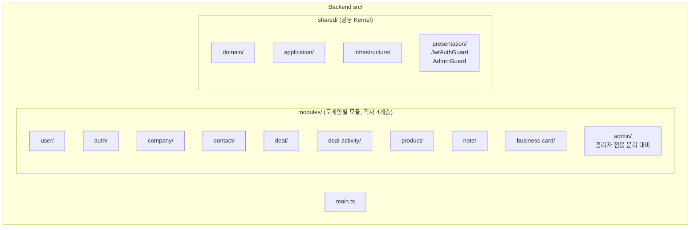

### 4.2 도메인 모듈 내부 구조 (Clean Architecture 4계층)

```mermaid
graph TB
    subgraph "modules/deal/"
        subgraph "presentation/ (Controller, Thin)"
            Ctrl[deal.controller.ts<br/>admin-deal.controller.ts]
            DTO[dto/<br/>create-deal.dto.ts]
            PresMap[mappers/<br/>deal-response.mapper.ts]
        end

        subgraph "application/ (UseCase)"
            Cmd[commands/<br/>create-deal.command.ts]
            Qry[queries/<br/>list-deals.query.ts]
            Handler[handlers/]
            Svc[services/<br/>deal.service.ts]
            Port[ports/<br/>ocr.port.ts]
        end

        subgraph "domain/ (외부 의존 X)"
            Ent[entities/<br/>deal.entity.ts]
            VO[value-objects/<br/>deal-stage.vo.ts]
            Evt[events/<br/>deal-status-changed.event.ts]
            RepoI[repositories/<br/>deal.repository.ts<br/>인터페이스만]
            Err[errors/]
        end

        subgraph "infrastructure/ (외부 시스템 어댑터)"
            Persist[persistence/<br/>prisma-deal.repository.ts]
            InfraMap[mappers/<br/>deal.mapper.ts]
            Module[deal.module.ts]
        end
    end

    Ctrl --> Svc
    Svc --> Ent
    Svc --> RepoI
    Persist -.implements.-> RepoI
    Persist --> Ent
    Module --> Ctrl
    Module --> Svc
    Module --> Persist
```

### 4.3 의존성 규칙 (Dependency Rule)

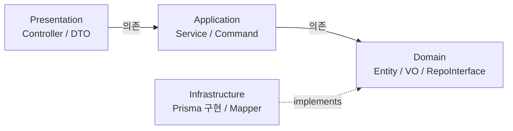

**핵심**: Infrastructure가 Domain의 인터페이스를 **구현**하지만, Domain은 Infrastructure를 **모름** (의존성 역전).

### 4.4 User vs Admin 라우트 분리

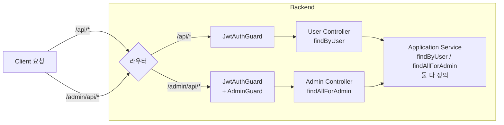

### 4.5 인증 흐름

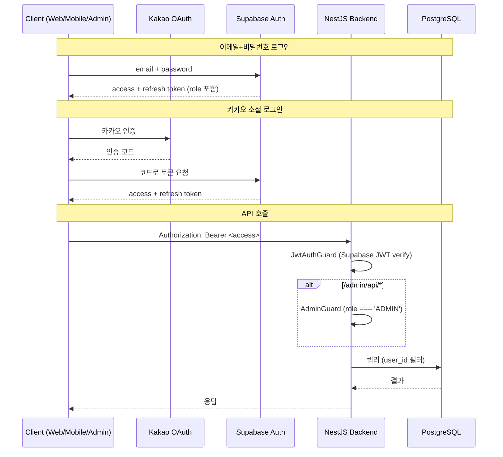

---

## 5. Frontend SW 아키텍처 (User 웹 / Mobile)

### 5.1 Feature-Sliced Design (FSD)

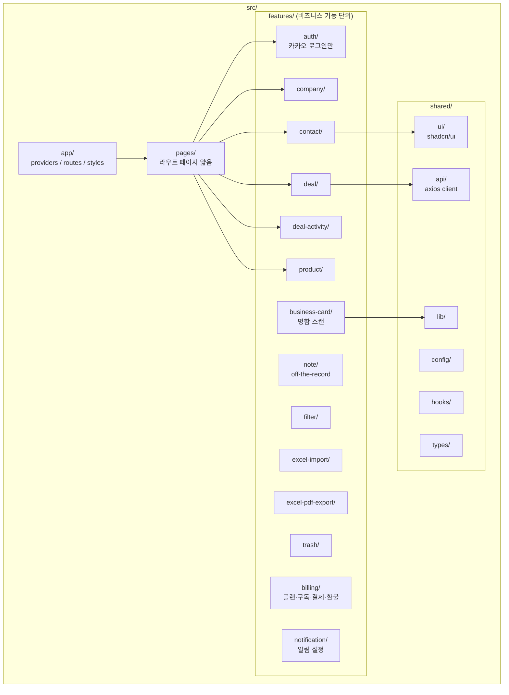

### 5.2 Feature 내부 구조

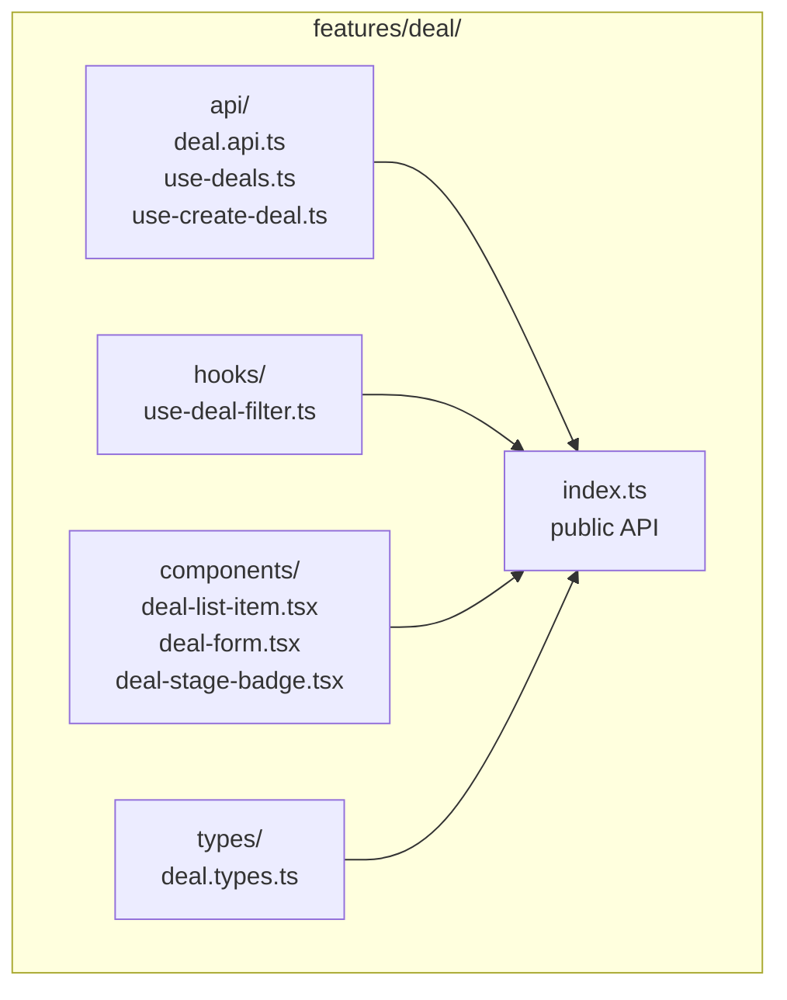

### 5.3 의존성 규칙

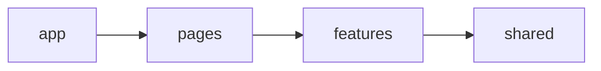

- `shared`는 다른 어느 것도 import 안 함
- `features` 간 import는 **`index.ts` public API만**
- `pages`는 비즈니스 로직 X (조합만)

### 5.4 상태 관리 분리

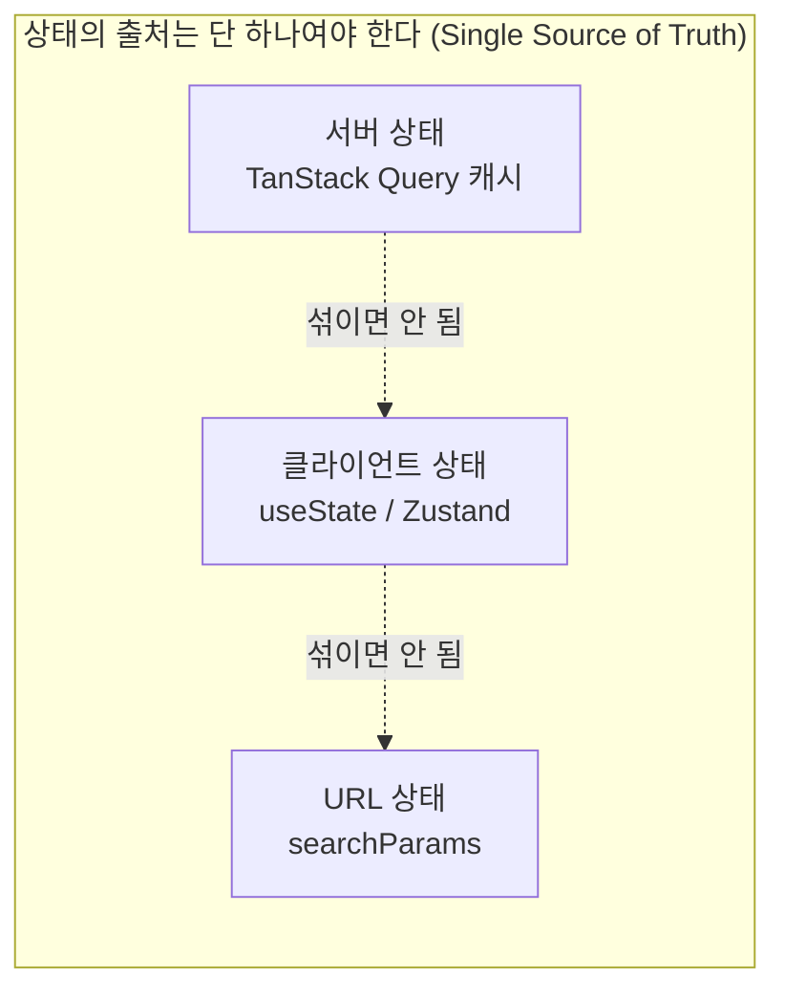

### 5.5 확장성 강화 5가지 (Frontend / Mobile 10년차 권장)

> 사용자가 프론트/모바일 경험이 부족하다는 점을 고려해, 향후 기능 추가·팀 확장·모바일 포팅에서 비용을 가장 크게 절감하는 5가지 패턴을 확정.

#### ① 백엔드 도메인과 프론트 feature 1:1 매핑

백엔드 `modules/customer`, `modules/deal`은 프론트 `features/customer`, `features/deal`과 **이름·경계 동일**.

**왜**: "Customer 도메인을 수정하면 어디까지 영향 받는가?"가 1초 안에 답이 나옴. AI에게 작업 지시 시 "Customer 도메인 전체"라고 하면 백엔드/프론트 양쪽이 같은 폴더 구조로 매칭됨.

#### ② Atomic Design + shadcn/ui (UI 컴포넌트 자가 소유)

shadcn/ui는 컴포넌트를 **복사해서 쓰는** 방식 (npm install이 아님).

```
shared/ui/
├── atoms/       Button, Input, Badge (shadcn/ui 베이스)
├── molecules/   FormField, SearchInput, DealStageBadge
└── organisms/   DataTable, FilterBar, DealCard
```

**왜**:
- 디자인 시스템 통째로 본인 소유 → 라이브러리 버전 묶임 X
- 모바일 포팅 시 atoms부터 NativeWind로 치환하면 organisms는 자동 적용
- AI가 "Button 컴포넌트 스타일 통일해줘" 했을 때 한 곳만 수정

#### ③ TanStack Query Key Factory 패턴

```typescript
// features/deal/api/deal-keys.ts
export const dealKeys = {
  all: ['deals'] as const,
  lists: () => [...dealKeys.all, 'list'] as const,
  list: (filter) => [...dealKeys.lists(), filter] as const,
  detail: (id) => [...dealKeys.all, 'detail', id] as const,
};
```

**왜**:
- 캐시 무효화 시 `queryClient.invalidateQueries({ queryKey: dealKeys.all })` 한 줄로 끝
- 키 충돌 0
- 모바일에서 동일 패턴 그대로 재사용

#### ④ OpenAPI 자동 타입 생성 (단일 진실 공급원)

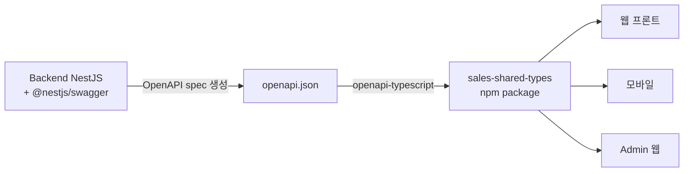

**왜**:
- 백엔드 API 변경 시 **타입 에러로 즉시 잡힘** (사람이 안 찾아도 됨)
- 웹/모바일/Admin 모두 동일 패키지 import → 일관성 자동 보장
- 모바일 포팅 시 API 호출 타입 100% 재사용

#### ⑤ 비즈니스 로직 = 훅, UI 컴포넌트 = 플랫폼별

```
features/deal/
├── hooks/
│   ├── use-deal-form.ts          ← 웹/모바일 공통
│   ├── use-deal-filter.ts        ← 웹/모바일 공통
│   └── use-deal-stage.ts         ← 웹/모바일 공통
└── components/
    ├── deal-card.web.tsx         ← 웹 전용
    └── deal-card.native.tsx      ← 모바일 전용 (3단계 이후)
```

**왜**:
- **70%+ 코드 재사용** 가능
- 비즈니스 로직(검증, 상태 전이, 필터링)은 100% 동일하게 hooks에 격리
- UI 컴포넌트만 플랫폼별로 분기 → AI 포팅 효율 극대화

### 5.6 모바일 포팅 시 코드 재사용 매트릭스

| 영역 | 웹 → 모바일 재사용률 | 변경 필요 |
|------|---------------------|----------|
| TanStack Query 훅 | 100% | 없음 |
| React Hook Form + Zod 스키마 | 100% | 없음 |
| 비즈니스 로직 훅 (filter / form / state) | 100% | 없음 |
| API 함수 (axios) | 95% | 토큰 저장소만 (SecureStore) |
| 타입 정의 | 100% | 없음 |
| 라우팅 | 0% | React Router → Expo Router |
| UI 컴포넌트 | 30% | shadcn/ui → NativeWind 자체 |
| 스타일 클래스명 | 95% | Tailwind ↔ NativeWind (거의 동일) |

→ **AI 포팅 시 70%+ 재사용 가능 = 모바일 개발 비용 대폭 절감**

---

## 6. Mobile 특화 아키텍처

### 6.1 오프라인 우선 (Offline-First)

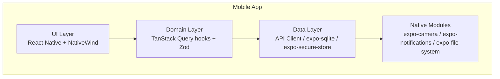

### 6.2 오프라인 동기화 흐름

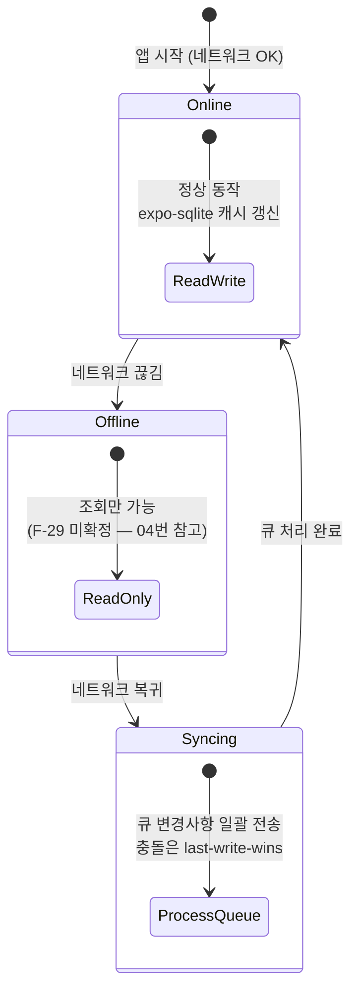

> **오프라인 쓰기 정책 미확정**: 새 기획은 "오프라인 쓰기 금지", 기존 결정은 "오프라인 쓰기+큐 동기화". [04_의사결정_필요사항.md](04_의사결정_필요사항.md) 참고.

### 6.3 명함 스캔 흐름

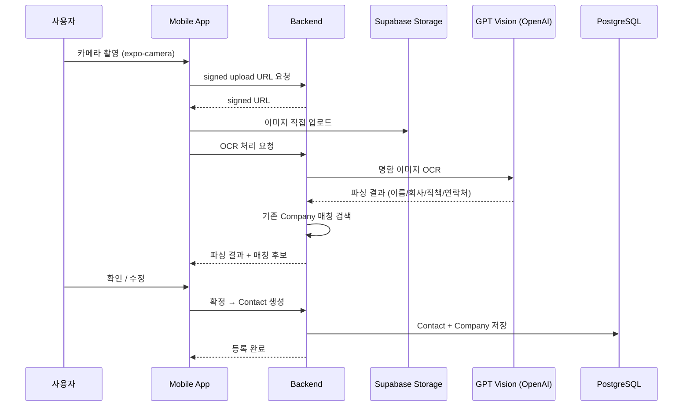

---

## 7. Admin 웹 SW 아키텍처

### 7.1 User 웹과 동일 FSD 구조 + 추가 라이브러리

| 항목 | User 웹 | Admin 웹 |
|------|---------|---------|
| 디렉토리 구조 | FSD | FSD (동일) |
| 데이터 테이블 | 자체 컴포넌트 | **TanStack Table** |
| 차트 | 없음 | **Recharts** |
| 모바일 반응형 | 필요 | **불필요** |
| API 호출 | `/api/*` | `/admin/api/*` |
| 권한 검증 | 로그인만 | 로그인 + `role === 'ADMIN'` |

### 7.2 권한 가드 흐름

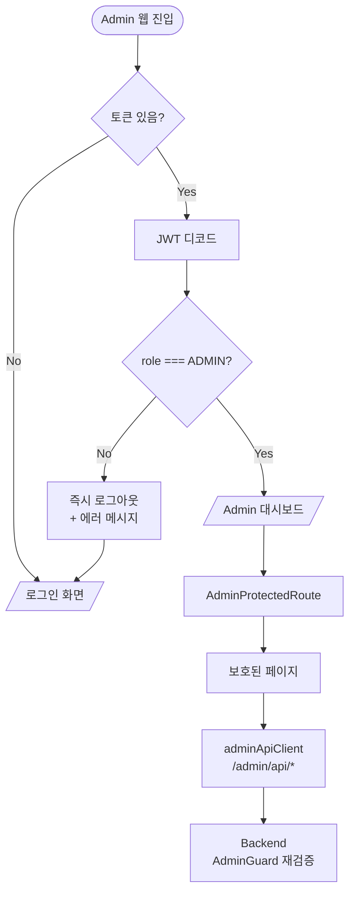

---

## 8. 데이터 격리 정책

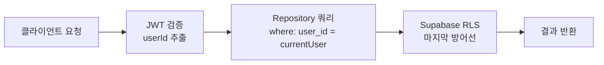

- 모든 사용자 데이터 테이블에 `user_id` FK
- 백엔드 쿼리에서 항상 `where: { userId: currentUser.id }` 명시
- Supabase RLS 정책 추가 (이중 방어)
- Admin만 `findAllForAdmin` 메서드로 우회 가능

---

## 9. 관련 문서

- [01_서비스_기획서.md](01_서비스_기획서.md) — 서비스 정체성, 도메인 구조
- [03_기능_및_UserFlow.md](03_기능_및_UserFlow.md) — 기능 목록과 사용자 흐름
- [04_의사결정_필요사항.md](04_의사결정_필요사항.md) — 모바일 전략, OCR 등 미확정
- [AGENT/Backend/architecture.md](AGENT/Backend/architecture.md) — 백엔드 상세 규칙
- [AGENT/Frontend/architecture.md](AGENT/Frontend/architecture.md) — 프론트 상세 규칙
- [AGENT/Mobile/architecture.md](AGENT/Mobile/architecture.md) — 모바일 상세 규칙
- [AGENT/Admin/architecture.md](AGENT/Admin/architecture.md) — Admin 웹 상세 규칙
