# 기능 목록 및 User Flow

> 새 기획(3인 합의)을 기반으로 한 **반드시 필요한 기능** 전체 + 사용자 흐름도
>
> 작성일: 2026-05-27
>
> **개발 순서**: 웹 우선 전체 완성 → AI를 통해 RN 모바일로 포팅 ([02_기술스택_및_아키텍처.md](02_기술스택_및_아키텍처.md) 0장 참고)
> 본 문서의 "모바일 전용" 표시는 최종 출시 시 모바일에서 동작하는 기능을 의미. 1단계 개발 시점에서는 모두 웹 기준으로 먼저 구현.

---

## 0. 빠른 요약

| 영역 | 기능 수 |
|------|---------|
| 인증 (카카오만) | 3개 |
| Company | 4개 |
| Contact | 6개 |
| Deal | 7개 |
| Product | 4개 |
| 검색 | 1개 |
| 입출력 | 2개 |
| 알림 | 2개 |
| 동기화 (오프라인 쓰기 포함) | 3개 |
| 휴지통 | 1개 |
| Admin (관리자) | 3개 |
| 결제 / 구독 | 7개 |
| **AI 회의록 (신규 채택)** | **4개** |
| **합계** | **49개 (F-01~49)** |

---

## 1. 기능 목록

### 1.1 인증 (카카오만 사용)

| ID | 기능 | 설명 | 예시 |
|----|------|------|------|
| F-01 | **카카오 로그인 / 회원가입** | Supabase Auth + Kakao OAuth. 최초 로그인 시 자동 회원가입 | 사용자가 첫 진입 → "카카오로 시작하기" 클릭 → 카카오 동의 화면 → 앱 홈으로 자동 진입. 회원가입 폼 없음 |
| F-02 | 로그아웃 | 자동 토큰 갱신 30일. 로그아웃 시 토큰 무효화 | 설정 → "로그아웃" 클릭 → 확인 다이얼로그 → 로그인 화면으로 복귀. 30일 내 재진입 시 자동 로그인 |
| F-03 | 사용자별 데이터 격리 | RLS + 백엔드 쿼리 이중 방어 | A 사용자가 등록한 "삼성전자" 거래처는 B 사용자에게 보이지 않음. 백엔드 쿼리 + DB RLS 두 단계 검증 |

> **결정 완료**: 카카오 로그인만 사용 (D-05). 이메일+비밀번호 로그인 / 이메일 인증 / 비밀번호 재설정 모두 제거.
> iOS 출시(4단계) 시 Apple 로그인 추가 예정.

### 1.2 Company (회사)

| ID | 기능 | 설명 | 예시 |
|----|------|------|------|
| F-06 | 회사 CRUD | 회사명(필수), 업종/주소/대표전화/웹사이트(선택) | "삼성전자" 등록 → 업종 "반도체", 본사 주소, 02-XXXX-XXXX, samsung.com 입력 |
| F-07 | 회사 오프더레코드 메모 | 비공개 자유 메모 | "삼성전자 - 매년 11월에 다음 해 예산 확정. 구매팀장 박OO 결정권자." 입력. 다른 사용자나 외부에 노출 X |
| F-08 | 회사 상세 통합 뷰 | 소속 Contact + 연결 Deal 목록 한 화면에 | "삼성전자" 클릭 → 한 화면에 "이 회사 소속 담당자 3명" + "이 회사와 진행 중 딜 5건" + "오프더레코드 메모" 표시 |
| F-09 | 회사 소프트 딜리트 | 30일 휴지통, Contact는 살아남고 연결만 해제 | "삼성전자" 삭제 → 휴지통으로 이동. 소속 담당자 "김부장"은 그대로 남고 회사 연결만 없어짐. 30일 내 복구 가능 |

### 1.3 Contact (담당자)

| ID | 기능 | 설명 | 예시 |
|----|------|------|------|
| F-10 | **명함 OCR 등록** | 카메라/업로드 → GPT Vision → 자동 추출 → 수정 가능 폼 | 미팅 후 명함 받음 → 앱에서 카메라로 촬영 → AI가 "김철수 / 삼성전자 / 구매팀장 / 010-1234-5678" 자동 추출 → 수정 화면에서 확인/수정 → 저장 |
| F-11 | Contact 수동 입력 | 이름(필수) + Company/부서/직책/전화/이메일/지역(선택) | 명함 없이 통화로 만난 사람 직접 입력. "이영희 / LG화학 / R&D / 010-XXXX" |
| F-12 | 담당자 오프더레코드 메모 | 회사 메모와 별도. 담당자 개인 인사이트 | "김부장 - 직접 연락 싫어함. 항상 비서 통해서 약속 잡기. 골프 좋아함." |
| F-13 | **거래처 합치기 (병합)** | 중복 Contact 2개 → 1개. Deal 모두 이전. 되돌릴 수 없음 | 명함 OCR로 "김철수" 등록 + 이전에 수동 입력한 "김 철수" 발견 → 둘 선택 후 "합치기" → 양쪽 딜 모두 한 Contact로 이전 |
| F-14 | Contact 엑셀 일괄 가져오기 | 컬럼 매핑 + 중복 감지(이메일/전화) + 부분 성공 | 기존 엑셀에 100명 거래처 있음 → 업로드 → "엑셀의 '이름' 컬럼 = 앱의 name" 매핑 → 검증 → "성공 95건 / 실패 3건(전화번호 오류) / 건너뜀 2건(중복)" 결과 표시 |
| F-15 | Contact 소프트 딜리트 | 30일 휴지통, 연결된 Deal은 살아남고 연결만 해제 | "퇴사한 김부장" 삭제 → 그가 담당했던 딜 3건은 남고 담당자만 비어있게 됨 |

### 1.4 Deal (영업 건)

| ID | 기능 | 설명 | 예시 |
|----|------|------|------|
| F-16 | Deal CRUD | 딜명(필수), Contact(필수), Product(선택), 금액/가능성/마감일/지역 | "삼성 반도체 라인 계측기 3대 납품" 등록 → 담당자 "김부장" 선택 → 제품 "XYZ-300" 선택 시 단가 5천만원 자동 입력 → 가능성 70% → 마감 2026-07-31 |
| F-17 | Deal 단계 관리 | 4단계: 초기접촉 / 협의중 / 성사 / 실패 | 처음 등록 시 "초기접촉" → 미팅 후 "협의중" → 견적 수락되면 "성사" 또는 경쟁사 채택되면 "실패" |
| F-18 | **Deal 복사** | 딜명/담당자/제품/금액/지역 복사. 단계는 초기접촉, 활동 기록 없음 | 작년 같은 고객에게 동일 제품 판매한 딜이 있음 → "복사" 버튼 → 새 딜 자동 생성 → 마감일만 새로 입력 |
| F-19 | **Deal Activity 타임라인** | 별도 엔티티. 날짜+텍스트 누적, 항목별 수정/삭제, 단계 변경 시 자동 기록 | 5월 20일 "2차 미팅. 가격 협의 중" 입력 → 5월 25일 "단계 변경: 초기접촉 → 협의중" 자동 기록 → 5월 28일 "경쟁사 대비 납기 우위" 입력. 모든 활동이 시간순 타임라인으로 표시 |
| F-20 | Deal 탭/컬럼 필터 + 정렬 | 탭(전체/단계별/이번달 마감/가능성 70%+), 컬럼 필터, 정렬 | "이번달 마감" 탭 클릭 → 5월에 마감 예정인 딜만 표시 → 추가로 "지역=서울" 필터 → "가능성 높은 순" 정렬 |
| F-21 | Deal 검색 | 딜명/담당자/회사/메모. 오프더레코드 제외 | 검색창에 "김철수" 입력 → 김철수가 담당자인 딜 5건 + 메모에 김철수가 언급된 딜 2건 표시. 오프더레코드 메모에 있어도 노출 안됨 |
| F-22 | Deal 소프트 딜리트 | 30일 휴지통. Activity도 함께 삭제 | "실패한 딜" 정리하려고 삭제 → 휴지통으로. 30일 내 복구 시 활동 타임라인까지 그대로 복원 |

### 1.5 Product (제품)

| ID | 기능 | 설명 | 예시 |
|----|------|------|------|
| F-23 | Product CRUD | 제품명(필수), 모델번호/단가/카테고리/설명(선택) | "주력 계측기 XYZ-300 / 모델 ABC-123 / 단가 5천만원 / 카테고리 측정장비 / 설명 ..." 등록 |
| F-24 | **단가 이력 관리** | 단가 수정 시 이전 단가 + 변경일 보관. Deal 금액은 입력 시점 고정 | 2026-03-01 단가 5000만원 → 2026-06-01 5500만원으로 인상. 3월에 등록한 딜은 5000만원 그대로, 6월 신규 딜은 5500만원 자동 입력. 제품 상세에서 "단가 이력" 탭으로 변경 흐름 확인 |
| F-25 | Product 엑셀 일괄 가져오기 | Contact와 동일 방식 | 제품 카탈로그 50개 엑셀 업로드 → 컬럼 매핑 → 일괄 등록 |
| F-26 | Product 소프트 딜리트 | 30일 휴지통. Deal 금액 유지, 제품 연결만 해제 | 단종된 "구형 XYZ-100" 삭제 → 그 제품을 참조했던 딜의 금액은 그대로 유지, 제품 연결만 끊김 |

### 1.6 검색

| ID | 기능 | 설명 | 예시 |
|----|------|------|------|
| F-27 | 전역 통합 검색 | 상단 검색창. Deal/Contact/Company 카테고리별 결과. 오프더레코드 제외 | "삼성" 입력 → "회사: 삼성전자 1건" + "담당자: 삼성전자 소속 3명" + "딜: 삼성 관련 5건" 카테고리별 그룹 결과 |

### 1.7 데이터 입출력

| ID | 기능 | 설명 | 예시 |
|----|------|------|------|
| F-28 | 엑셀 Export | Deal/Contact 각각. 현재 필터·탭 조건 유지. 오프더레코드 포함 여부 선택 | 딜 목록에서 "이번달 마감" 탭 적용 → "엑셀 내보내기" → 그 필터된 결과만 엑셀로 다운. 오프더레코드 메모 포함 여부 체크박스 |
| F-29 | PDF Export | Deal 목록. 헤더에 날짜+사용자명 자동. 오프더레코드 제외 | 월말 보고용. 헤더에 "2026-05-31 / 김영업" 자동 표시 + 딜 목록 표 |

### 1.8 알림

| ID | 기능 | 설명 | 예시 |
|----|------|------|------|
| F-30 | **이메일 알림** | 마감 3일 전 + 당일. 단계 성사/실패면 제외 | 마감일 7월 31일 딜 → 7월 28일 오전 이메일 "3일 후 마감 예정" + 7월 31일 오전 "오늘 마감" |
| F-31 | **푸시 알림** | 동일 조건. 모바일 권한 동의 시 활성화 | 같은 조건으로 핸드폰 푸시 알림. 운전 중에도 마감 임박 인지 가능 |

> **카카오톡 알림 가능성**: 카카오 로그인 사용자에게 카카오 알림톡 발송 검토 ([04번](04_의사결정_필요사항.md) 참고).

### 1.9 멀티 디바이스 동기화

| ID | 기능 | 설명 | 예시 |
|----|------|------|------|
| F-32 | PC ↔ 모바일 동기화 | PC 입력 → 모바일 즉시 조회 | 오전 사무실 PC에서 거래처 메모 작성 → 오후 외근 차에서 핸드폰 열면 그대로 보임 |
| F-33 | 오프라인 조회 + **쓰기** | 마지막 동기화 데이터 조회 + 변경 사항 큐 적재 (모든 도메인 쓰기 가능) | 지하주차장(인터넷 X) → "방금 미팅한 사람 메모 추가" → 큐에 저장 → 지상 나오면 자동 동기화 |
| F-34 | 자동 동기화 | 온라인 복귀 시 자동. 별도 조작 불필요. 충돌은 last-write-wins | 와이파이 다시 연결되면 자동으로 큐 처리 + 서버 데이터 갱신 |

### 1.10 휴지통

| ID | 기능 | 설명 | 예시 |
|----|------|------|------|
| F-35 | 휴지통 관리 | Deal/Contact/Company/Product 30일 보관 + 복구 가능 | 실수로 삭제한 거래처 → 휴지통 탭에서 찾기 → "복구" 클릭 → 원위치로 복원 |

### 1.11 Admin (관리자)

| ID | 기능 | 설명 | 예시 |
|----|------|------|------|
| F-36 | Admin 로그인 | `role === 'ADMIN'` 검증. 일반 사용자는 진입 불가 | admin.yourdomain.com 진입 → 카카오 로그인 → role 검증 → ADMIN만 통과 |
| F-37 | 사용자 / 데이터 조회 | 전체 사용자, 거래처, 영업건 모니터링 | 운영자가 "최근 가입한 사용자 10명" 확인 + 특정 사용자 클릭 → 그 사용자의 사용 패턴 조회 |
| F-38 | 시스템 통계 | DAU, 가입자 수, 사용 통계 | 대시보드에 "오늘 활성 사용자 234명" / "이번 달 신규 가입 45명" / 차트 |

### 1.12 결제 / 구독 (외부 공개 전 필수)

| ID | 기능 | 설명 | 예시 |
|----|------|------|------|
| F-39 | **Plan(요금제) 조회** | Free / Pro / Enterprise. 기능 비교 표. 트라이얼 기간 | 설정 → "요금제" 클릭 → "Free: Contact 50개 / Pro: 무제한, 월 9,900원 / 14일 무료 체험" 비교표 |
| F-40 | **구독 시작** | Plan 선택 → 결제 수단 등록 → Subscription 생성 | "Pro로 업그레이드" 클릭 → 카카오페이/카드/계좌이체 선택 → 결제 수단 등록 → "Pro 구독 활성화" |
| F-41 | **결제 처리** | Payment 시도/완료/실패. PG사 또는 계좌이체 워크플로우 | 매월 15일 자동 결제 시도 → 성공/실패 결과 기록 → 실패 시 사용자에게 알림 + 재시도 |
| F-42 | **결제 수단 관리** | PaymentMethod 추가/변경/기본 설정. PG사 토큰만 보관 | 카드 만료 시 새 카드 등록 → 기존 카드 비활성화 → 새 카드를 기본으로 설정 |
| F-43 | **구독 취소** | 즉시 취소(환불 동반) 또는 기간 만료 시 취소 예약 | "구독 취소" → "다음 결제일까지 사용 후 자동 종료" 또는 "지금 즉시 취소 + 사용일 비례 환불" 선택 |
| F-44 | **청구서 / 영수증** | Invoice 목록 + PDF 다운로드 | "결제 내역" 메뉴 → 월별 청구서 목록 → 각각 PDF 다운로드 (회사 비용 처리용) |
| F-45 | **환불 요청** | 7일 이내 무조건 환불 (전자상거래법). 사유 입력 | 결제 후 5일 만에 마음 바뀜 → "환불 요청" → 사유 입력 → 자동 승인 + 환불 처리 |

**구독 상태**: `trialing / active / past_due / paused / canceled`

**결제 수단**: 카드 (PG사 토큰), 카카오페이, **계좌이체** (외부 공개 초기 가능)

**한국 법 준수**:
- 7일 이내 무조건 환불 (전자상거래법)
- 카드 정보 평문 저장 절대 금지 (PG사 토큰만)
- 명세서/영수증 발급 의무

### 1.13 AI 회의록 ✅ 채택 (2026-05-27)

| ID | 기능 | 설명 | 예시 |
|----|------|------|------|
| F-46 | **회의 음성 노트** | 미팅 녹음 → STT 텍스트 추출 → AI 자동 요약 | 미팅 시작 시 "녹음 시작" → 1시간 미팅 종료 후 "정지" → STT가 텍스트 변환 → AI가 요약본 생성 (날짜/회사/담당자/품목/진행단계/상세내용/향후계획/필요액션) |
| F-47 | **회의 텍스트 노트** | 사용자 직접 입력 → AI 자동 요약 | 운전 중 못 녹음 → 미팅 후 카페에서 텍스트로 메모 입력 → AI가 동일 포맷으로 요약본 생성 |
| F-48 | **AI 요약 확인 / 수정 후 저장** | 생성된 회의록 검토 + 수정 가능 + 저장 | AI가 만든 회의록 보고 "필요액션" 누락된 부분 추가 → 저장 |
| F-49 | **Deal 활동 기록 연동** | 회의록 저장 후 Deal과 연동 → Deal Activity 탭에 해당 날짜 로그 자동 생성 (내용: 회의록 링크) | "삼성 반도체 라인" 딜에 연동 → 딜 상세의 Activity 탭에 "2026-05-27 - AI 회의록 [링크]" 자동 추가 |

**회의록 구성 항목**: 날짜 · 회사 · 담당자 · 부서 · 품목 · 진행단계 · 상세내용 · 향후계획 · 필요액션

**검토 사항** (구현 시점에 결정):
- STT 공급자 (OpenAI Whisper / Google STT / Naver Clova STT)
- AI 요약 모델 (Claude / GPT)
- 녹음 데이터 보관 정책 (Storage 비용 + 민감 정보)
- 한국어 STT 품질 검증

**구독 상태**: `trialing / active / past_due / paused / canceled`

**결제 수단**: 카드 (PG사 토큰), 카카오페이, **계좌이체**(3단계 초기에 사용 가능)

**한국 법 준수**:
- 7일 이내 무조건 환불 (전자상거래법)
- 카드 정보 평문 저장 절대 금지 (PG사 토큰만)
- 명세서/영수증 발급 의무

---

## 2. 화면 목록 (User 측)

| 경로 | 화면 | 관련 기능 |
|------|------|----------|
| /login | 카카오 로그인 | F-01 |
| / | 대시보드 (이번달 마감, 가능성 70%+, 최근 활동) | F-20 |
| /deals | 딜 목록 (탭/필터/정렬/검색) | F-16~F-22 |
| /deals/:id | 딜 상세 (정보 + Activity 타임라인) | F-16, F-18, F-19 |
| /contacts | 거래처 목록 | F-10~F-15 |
| /contacts/:id | 거래처 상세 (정보 + 오프더레코드 + 연결 Deal) | F-11, F-12 |
| /contacts/scan | 명함 스캔 | F-10 |
| /companies | 회사 목록 | F-06 |
| /companies/:id | 회사 상세 (정보 + 소속 Contact + Deal + 메모) | F-07, F-08 |
| /products | 제품 목록 | F-23 |
| /products/:id | 제품 상세 (정보 + 단가 이력) | F-24 |
| /settings | 계정 / 알림 / 휴지통 | F-30, F-31, F-35 |
| /billing | 플랜 / 구독 / 결제 수단 | F-39~F-43 |
| /billing/invoices | 청구서 / 영수증 목록 | F-44 |
| /billing/refund | 환불 요청 | F-45 |
| /meetings | AI 회의록 목록 | F-46~F-48 |
| /meetings/:id | 회의록 상세 (수정 + Deal 연동) | F-48, F-49 |
| /meetings/record | 회의 음성 녹음 | F-46 |
| /meetings/note | 회의 텍스트 입력 | F-47 |

---

## 3. User Flow 다이어그램

### 3.1 전체 흐름 지도

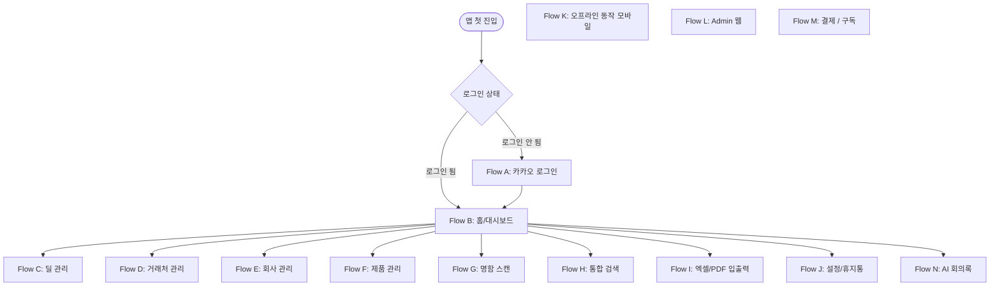

### 3.2 Flow A — 카카오 로그인 (회원가입 통합)

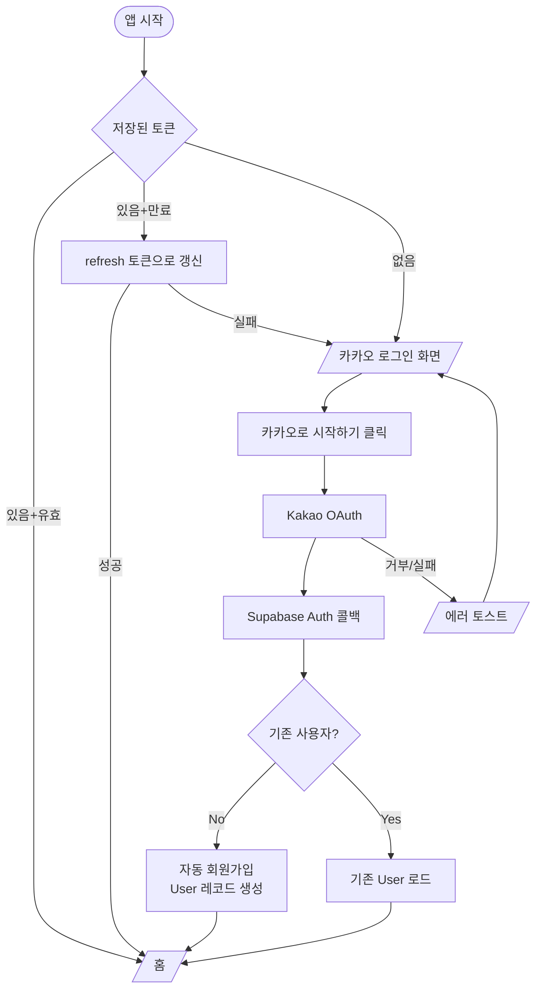

### 3.3 Flow C — 딜 관리

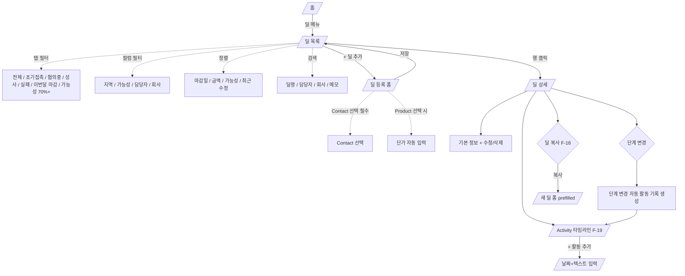

### 3.4 Flow D — 거래처 관리

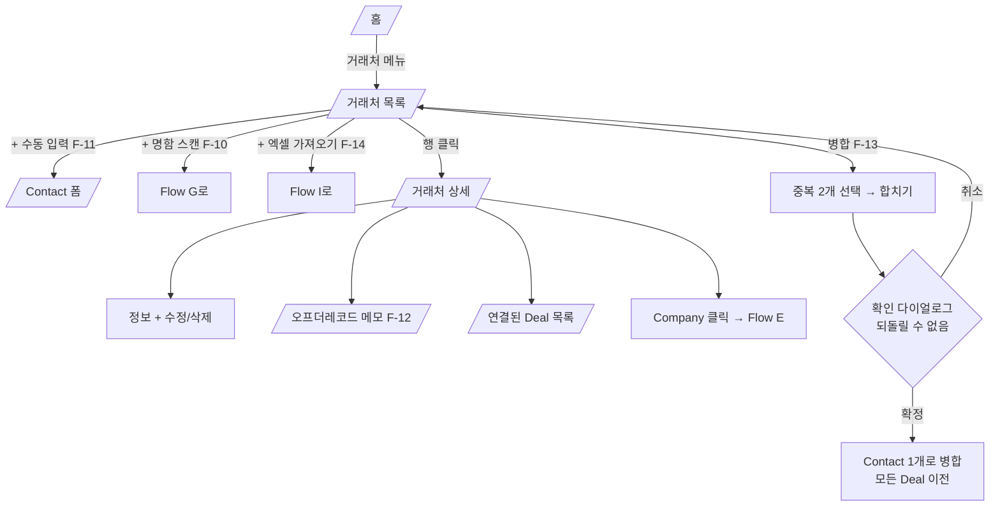

### 3.5 Flow E — 회사 관리

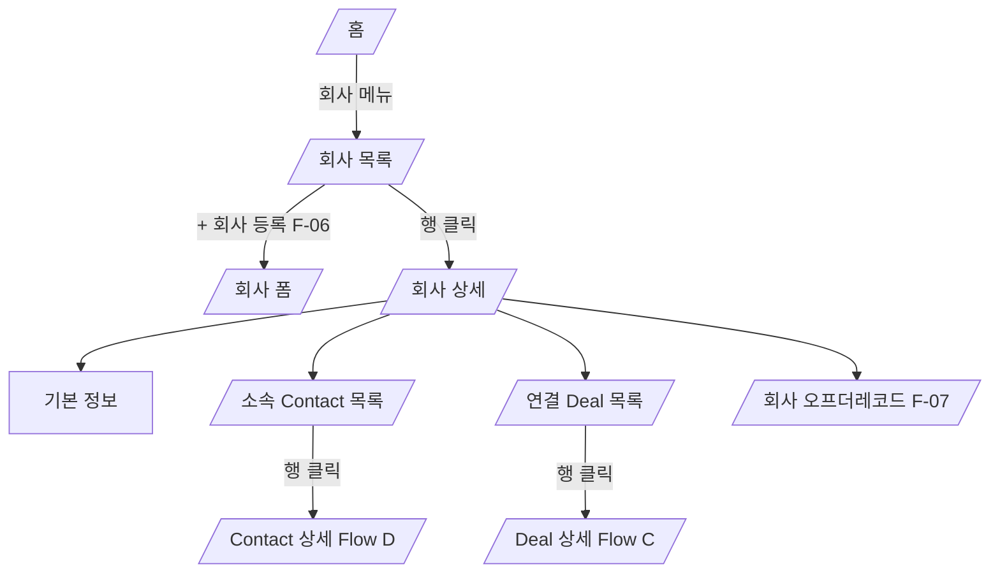

### 3.6 Flow F — 제품 관리

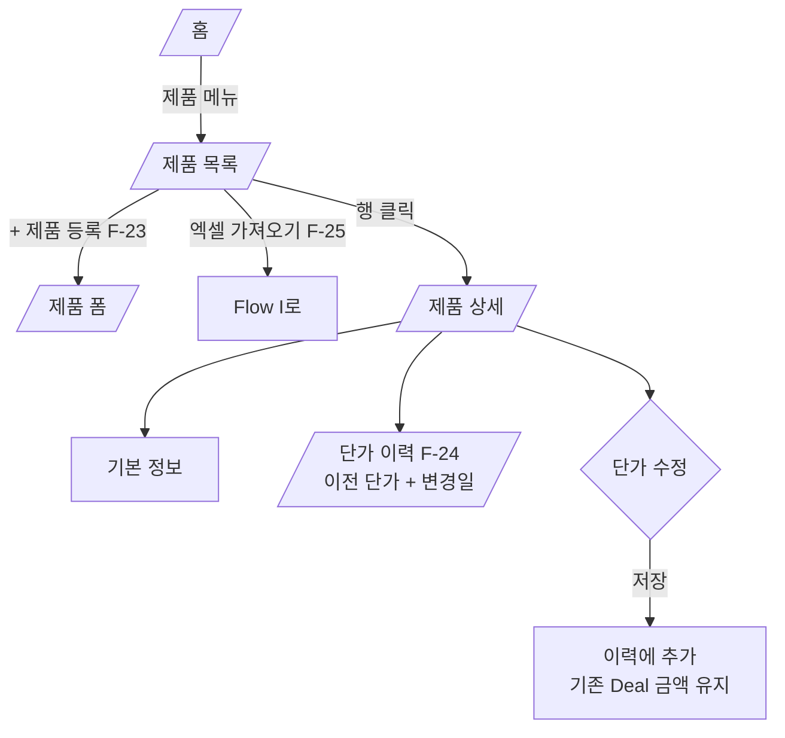

### 3.7 Flow G — 명함 스캔 (모바일 전용)

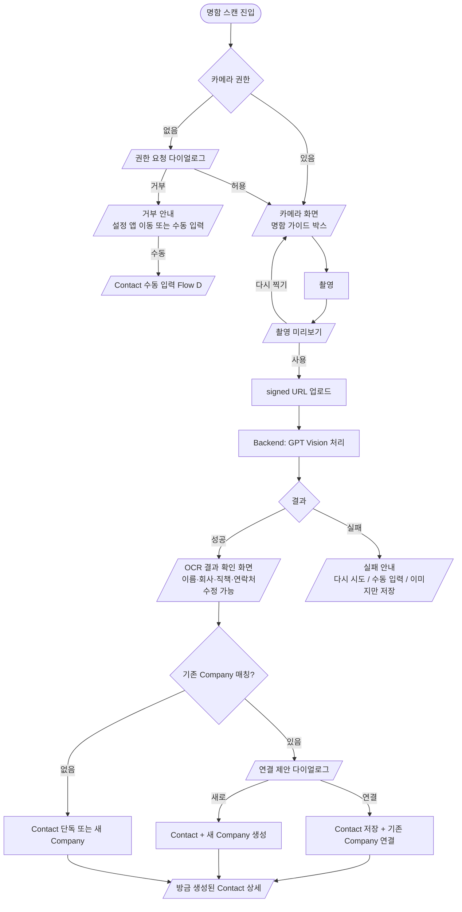

### 3.8 Flow H — 통합 검색

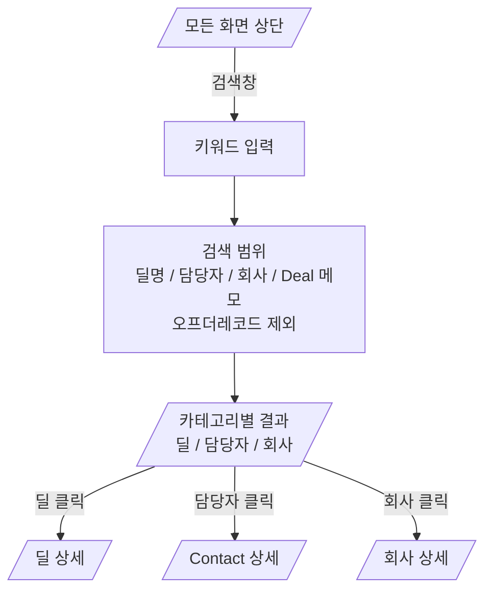

### 3.9 Flow I — 엑셀 / PDF 입출력

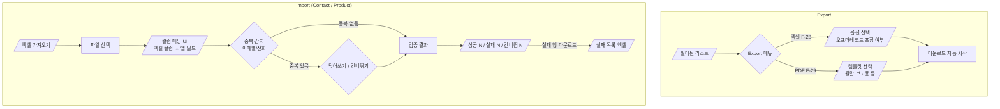

### 3.10 Flow J — 설정 / 휴지통

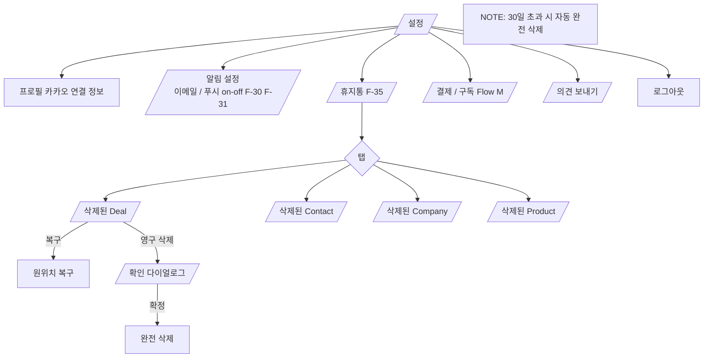

### 3.11 Flow K — 오프라인 동작 (모바일 전용)

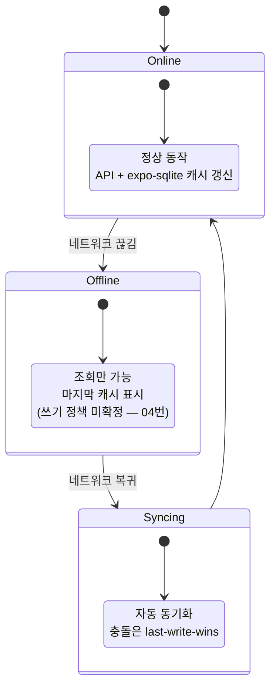

### 3.12 Flow L — Admin 웹

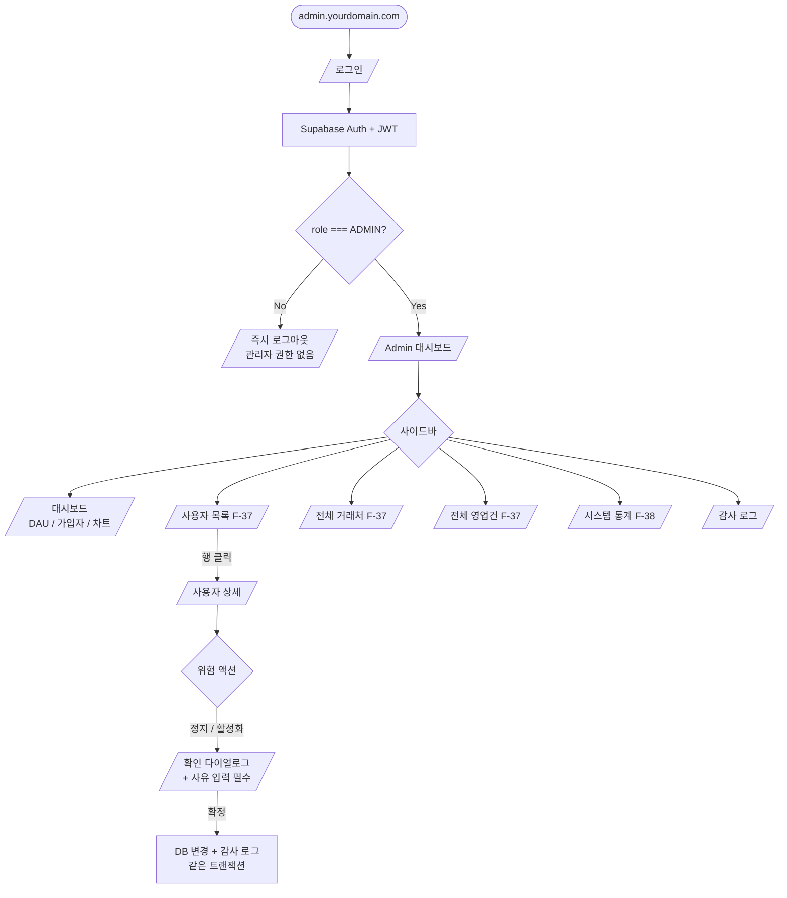

### 3.13 Flow M — 결제 / 구독 (3단계 외부 공개 시점 진입)

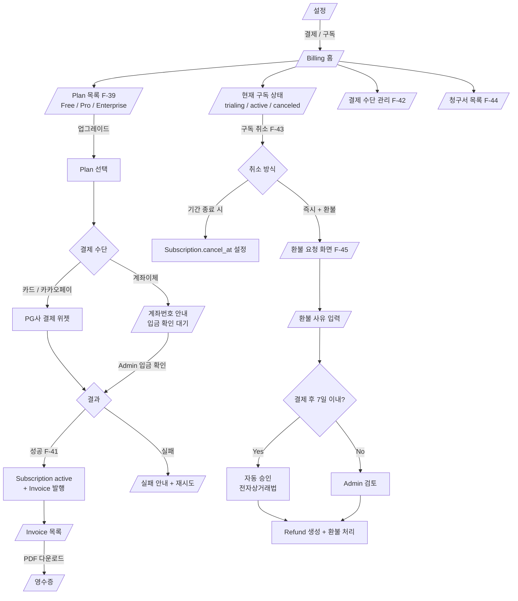

#### 3.13.1 Subscription 상태 전이

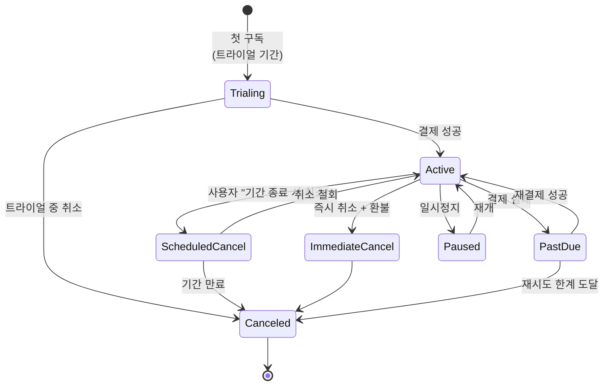

### 3.14 Flow N — AI 회의록

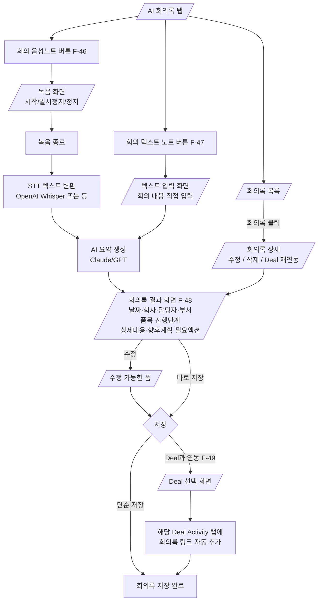

---

## 4. 도메인 관계도 (User Flow와 매핑)

### 4.1 영업 관리 핵심 도메인

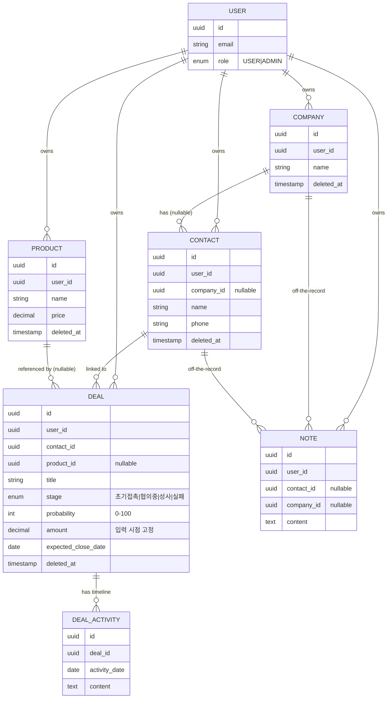

### 4.2 AI 회의록 도메인

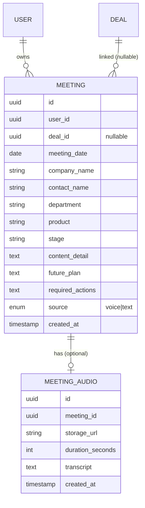

> Meeting과 Deal은 nullable 연관. 회의록 단독 작성 가능 + 나중에 Deal과 연동 가능.

### 4.3 결제 / 구독 도메인

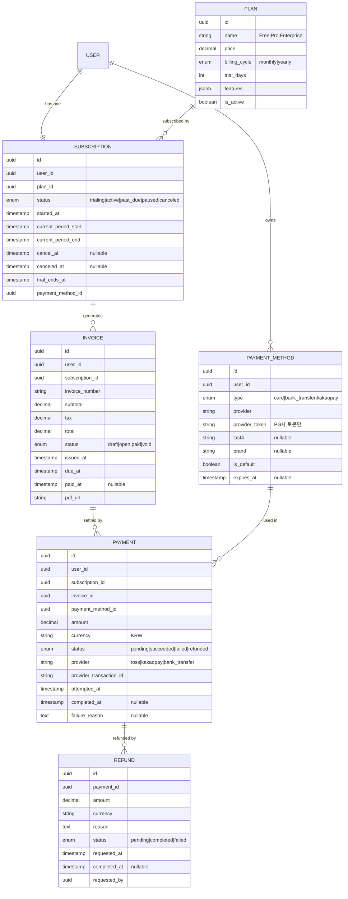

> 구체 컬럼/인덱스/제약은 DB 스키마 설계 단계에서 직접 결정.

---

## 5. 누락 / 확인 필요 (참고)

UserFlow 작성 중 발견된 미해결 항목은 [04_의사결정_필요사항.md](04_의사결정_필요사항.md)에 정리.

- 모바일 오프라인 쓰기 정책 (조회만? 쓰기+큐?)
- OCR 신뢰도 낮을 때 UX
- 거래처/제품 중복 정책 세부
- 결제 PG사 선택 (Toss / KakaoPay / Stripe)
- 환불 정책 세부 (7일 후 처리)
- Plan 등급별 기능 제한 (Free 사용 제한, Pro 상한)

---

## 6. 관련 문서

- [01_서비스_기획서.md](01_서비스_기획서.md) — 서비스 정체성
- [02_기술스택_및_아키텍처.md](02_기술스택_및_아키텍처.md) — 기술 결정
- [04_의사결정_필요사항.md](04_의사결정_필요사항.md) — 미해결 결정
- [05_추가_기능_아이디어.md](05_추가_기능_아이디어.md) — 검토 대기
