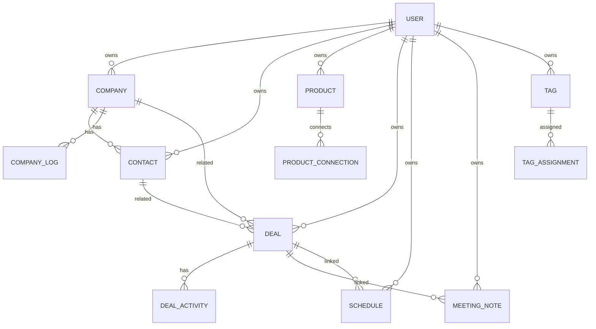

# 데이터 모델 / ERD 초안

> MVP는 명확한 영업 도메인 모델을 사용하되, 태그/메모/metadata/custom field로 확장성을 확보한다.

---

## 1. 핵심 엔티티

```text
User
  ├─ Company
  │   ├─ CompanyLog
  │   └─ Contact
  ├─ Product
  ├─ Deal
  │   └─ DealActivity
  ├─ Schedule
  ├─ MeetingNote
  ├─ Tag
  └─ ImportJob / ExportJob / AuditLog / Notification
```

## 2. 공통 필드 원칙

대부분의 사용자 데이터 테이블은 다음 필드를 가진다.

- id
- userId
- createdAt
- updatedAt
- deletedAt
- metadata

확장 필드는 DB 구조에는 준비하되 MVP UI에서는 숨긴다.

## 3. User

- id
- email
- displayName
- role: USER / ADMIN
- authProvider
- createdAt
- updatedAt

## 4. Company

- id
- userId
- name
- location
- industry
- memo
- metadata
- deletedAt

관계:

- Company 1:N Contact
- Company 1:N CompanyLog
- Company N:M Product through ProductConnection
- Company 1:N Deal
- Company 1:N Schedule
- Company 1:N MeetingNote

## 5. CompanyLog

- id
- userId
- companyId
- logDate
- title
- content
- createdAt
- updatedAt
- deletedAt

목적:

- 회사 자체 연혁/히스토리/변경 내역 기록

## 6. Contact

- id
- userId
- companyId nullable
- name
- department
- position
- location nullable
- phone
- email
- memo
- metadata
- deletedAt

관계:

- Contact N:1 Company
- Contact N:M Product through ProductConnection
- Contact 1:N Deal
- Contact 1:N Schedule
- Contact 1:N MeetingNote

## 7. Product

- id
- userId
- name
- category
- memo
- unitPrice nullable
- metadata
- deletedAt

관계:

- Product N:M Company/Contact/Deal through ProductConnection

## 8. ProductConnection

제품과 회사/거래처/딜의 연결 의미를 저장한다.

- id
- userId
- productId
- targetType: COMPANY / CONTACT / DEAL
- targetId
- connectionType
- memo
- createdAt
- updatedAt
- deletedAt

기본 connectionType:

- INTERESTED
- DELIVERED
- PROPOSED
- COMPETITOR
- MAINTENANCE
- OTHER

## 9. Deal

- id
- userId
- companyId nullable
- contactId nullable
- title
- amount
- currency default KRW
- stage
- likelihoodStatus: POSITIVE / NEUTRAL / NEGATIVE
- likelihoodPercent nullable
- memo
- metadata
- deletedAt

기본 stage:

- INITIAL_CONTACT
- IN_DISCUSSION
- WON
- LOST

관계:

- Deal N:1 Company
- Deal N:1 Contact
- Deal N:M Product through ProductConnection
- Deal 1:N DealActivity
- Deal 1:N Schedule
- Deal 1:N MeetingNote nullable

## 10. DealActivity

- id
- userId
- dealId
- activityDate
- typeId
- title
- content
- isAutoGenerated
- metadata
- deletedAt

## 11. DealActivityType

- id
- userId nullable
- name
- isSystem
- createdAt

시스템 기본 타입:

- 메모
- 전화
- 미팅
- 이메일
- 단계변경
- 회의록연결

## 12. Schedule

- id
- userId
- title
- startAt
- endAt
- allDay
- companyId nullable
- contactId nullable
- dealId nullable
- location
- memo
- source: INTERNAL / GOOGLE
- externalCalendarId nullable
- externalEventId nullable
- metadata
- deletedAt

## 13. MeetingNote

- id
- userId
- dealId nullable
- companyId nullable
- contactId nullable
- meetingDate
- companyName
- contactName
- department
- productName
- stageText
- detail
- futurePlan
- requiredAction
- rawInput
- aiOutput
- metadata
- deletedAt

## 14. Tag

- id
- userId
- name
- color
- createdAt
- updatedAt

## 15. TagAssignment

- id
- userId
- tagId
- targetType: COMPANY / CONTACT / PRODUCT / DEAL / SCHEDULE / MEETING_NOTE
- targetId

## 16. PersonalMemo

개인 메모가 별도 테이블이 필요한 경우 사용한다. 단순한 MVP에서는 각 엔티티 memo 필드로 시작할 수 있다.

- id
- userId
- targetType
- targetId
- content
- isSensitive
- createdAt
- updatedAt
- deletedAt

## 17. AuditLog

- id
- actorUserId
- action
- targetType
- targetId
- reason nullable
- metadata
- createdAt

민감 데이터 원문 조회는 반드시 AuditLog를 남긴다.

## 18. Notification

- id
- userId
- type
- channel
- targetType
- targetId
- scheduledAt
- sentAt nullable
- status
- metadata

## 19. ImportJob

- id
- userId
- targetType
- fileName
- status
- aiMapping
- resultSummary
- createdAt
- completedAt nullable

## 20. Mermaid ERD




