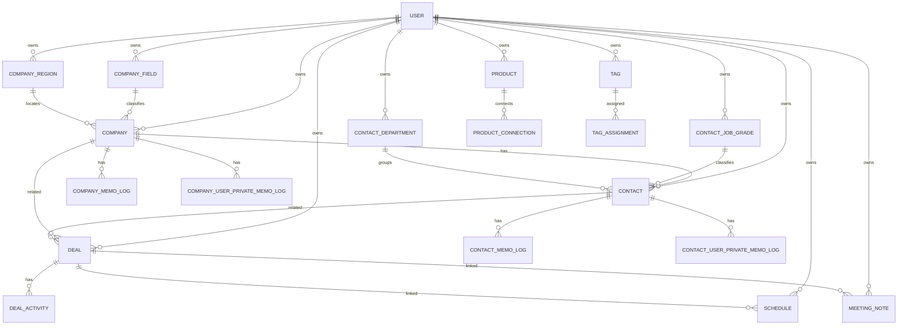

# 데이터 모델 / ERD 초안

> MVP는 명확한 영업 도메인 모델을 사용하되, 태그/메모/metadata/custom field로 확장성을 확보한다.

---

## 0. 현재 구현 상태

현재 `BE/prisma/schema.prisma`와 migration 기준으로 구현된 DB 범위:

- Auth/User: `User`, `UserOAuthAccount`, `AuthDevice`, `AuthSession`
- Company 기본 도메인: `Company`, `CompanyField`, `CompanyRegion`, `CompanyMemoLog`, `CompanyUserPrivateMemoLog`
- Contact 기본 도메인: `Contact`, `ContactJobGrade`, `ContactDepartment`, `ContactMemoLog`, `ContactUserPrivateMemoLog`
- Product 기본 도메인: `Product`, `ProductCategory`, `ProductStatus`, `ProductMemoLog`, `ProductUserPrivateMemoLog`
- Deal 기본 도메인: `Deal`, `DealProduct`, `DealFollowingActionLog`, `DealMemoLog`
- Schedule 기본 도메인: `Schedule`, `ScheduleDeal`
- MeetingNote 수동 도메인: `MeetingNote`, `MeetingNoteCompany`, `MeetingNoteContact`, `MeetingNoteProduct`, `MeetingNoteDeal`
- DataImport: `ImportTemplate`, `ImportUserLog`, `ImportUserLogRow`

현재 구현 기준 migration:

- `BE/prisma/migrations/20260611000000_add_company_domain/migration.sql`
- `BE/prisma/migrations/20260611010000_add_contact_domain/migration.sql`
- `BE/prisma/migrations/20260611020000_add_product_domain/migration.sql`
- `BE/prisma/migrations/20260612000000_add_deal_domain/migration.sql`
- `BE/prisma/migrations/20260612010000_add_deal_product_join/migration.sql`
- `BE/prisma/migrations/20260614010000_add_user_timezone/migration.sql`
- `BE/prisma/migrations/20260614020000_add_schedule_domain/migration.sql`
- `BE/prisma/migrations/20260615000000_add_meeting_note_domain/migration.sql`
- `BE/prisma/migrations/20260629010000_add_business_card_scan_log/migration.sql`
- `BE/prisma/migrations/20260630010000_add_import_templates_and_logs/migration.sql`

아직 DB에 구현되지 않은 계획 범위:

- Product 후속 확장: `ProductLog`, `ProductConnection`
- `DealActivity`
- `Tag`
- `TagAssignment`
- `PersonalMemo`
- `AuditLog`
- `Notification`
- persistent `ImportJob`

범용 `ExportJob` table은 현재 제품 방향에서 제외한다. 회사/담당자/제품/딜 export는 각 도메인 API가 동기 xlsx 파일로 내려준다.

이 문서는 제품 관점의 전체 목표 모델을 설명한다. 실제 구현 여부와 컬럼 상세는 `AGENT/SOFTWARE_AGENT/DB_SCHEMA/README.md`와 각 schema 문서를 우선 확인한다.

## 1. 핵심 엔티티

```text
User
  ├─ CompanyField
  ├─ CompanyRegion
  ├─ Company
  │   ├─ CompanyMemoLog
  │   ├─ CompanyUserPrivateMemoLog
  │   └─ Contact
  │       ├─ ContactMemoLog
  │       └─ ContactUserPrivateMemoLog
  ├─ ContactJobGrade
  ├─ ContactDepartment
  ├─ Product
  │   ├─ ProductMemoLog
  │   └─ ProductUserPrivateMemoLog
  ├─ ProductCategory
  ├─ ProductStatus
  ├─ Deal
  │   ├─ DealProduct
  │   ├─ DealFollowingActionLog
  │   ├─ DealMemoLog
  │   ├─ ScheduleDeal
  │   └─ MeetingNoteDeal
  ├─ Schedule
  │   └─ ScheduleDeal
  ├─ MeetingNote
  │   ├─ MeetingNoteCompany
  │   ├─ MeetingNoteContact
  │   ├─ MeetingNoteProduct
  │   └─ MeetingNoteDeal
  ├─ ImportUserLog
  │   └─ ImportUserLogRow
  ├─ Tag
  └─ AuditLog / Notification / persistent ImportJob
```

## 2. 공통 필드 원칙

대부분의 사용자 데이터 테이블은 다음 필드를 가진다.

- id
- userId
- createdAt
- updatedAt
- deletedAt
- metadata

확장 필드는 DB 구조에는 준비하되 MVP UI에서는 숨긴다.

## 3. User

- id
- email
- displayName
- role: USER / ADMIN
- authProvider
- createdAt
- updatedAt

## 4. Company

- id
- userId
- companyName
- companyFieldId
- companyRegionId
- createdAt
- updatedAt
- deletedAt
- deletedByUserId
- trashExpiresAt

관계:

- Company 1:N Contact
- Company N:1 CompanyField
- Company N:1 CompanyRegion
- Company 1:N CompanyMemoLog
- Company 1:N CompanyUserPrivateMemoLog
- Company N:M Product through ProductConnection
- Company 1:N DealCompany
- Company 1:N MeetingNoteCompany
- Company 1:N MeetingNoteContact

정책:

- 회사 목록은 `createdAt DESC`로 정렬한다.
- 회사 목록 응답에는 최근 수정일을 포함하지 않는다.
- 회사 목록 응답에는 `contactCount`를 포함해 회사별 연결 담당자 수를 표시한다.
- 회사 목록 응답에는 `dealCount`를 포함해 회사별 연결 딜 수를 표시한다.
- 회사 단건 응답 자체에는 담당자 수와 딜 수를 병합하지 않는다.
- 회사 단건 화면에서 필요한 연결 Contact 전체 목록은 별도 API로 조회한다.
- 회사 단건 화면에서 필요한 연결 Deal 전체 목록은 별도 API로 조회한다.
- 회사 본문 row 삭제는 실제 삭제가 아니라 `deletedAt`, `deletedByUserId`, `trashExpiresAt = deletedAt + 7일` 설정으로 처리한다.
- 회사 목록/상세/검색/옵션/export와 회사 연결 담당자/딜 목록은 `deletedAt IS NULL` 데이터만 대상으로 한다.
- 회사 일반 메모/비밀 메모 로그 삭제는 `deletedAt`, `deletedByUserId`, `trashExpiresAt` 기반 7일 휴지통 보관으로 처리한다.
- 회사 생성 요청의 `companyMemo`는 `Company` 테이블에 저장하지 않고 `CompanyMemoLog` 첫 데이터로 저장한다.
- 회사명, 회사분야, 회사지역은 회사 단건 수정 API로 변경할 수 있다.

## 5. CompanyField / CompanyRegion / CompanyMemoLog / CompanyUserPrivateMemoLog

### CompanyField

- id
- userId
- field
- createdAt

목적:

- 회사 분야 필터 옵션을 사용자별로 관리한다.
- 이미 회사에 매핑된 분야는 삭제할 수 없다.
- 수정은 제공하지 않고 생성과 삭제만 제공한다.

### CompanyRegion

- id
- userId
- region
- createdAt

목적:

- 회사 지역 필터 옵션을 사용자별로 관리한다.
- 이미 회사에 매핑된 지역은 삭제할 수 없다.
- 수정은 제공하지 않고 생성과 삭제만 제공한다.

### CompanyMemoLog

- id
- companyId
- userId
- memoType
- memo
- createdAt
- updatedAt
- deletedAt
- deletedByUserId
- trashExpiresAt

목적:

- 회사 특징에 대한 일반 메모 로그를 저장한다.
- 회사 생성 시 `companyMemo`가 있으면 이 테이블의 첫 데이터로 저장하고 `memoType`은 서버가 `초기 메모`로 저장한다.
- 독립적인 회사 메모 로그 생성 API는 `memoType`, `memo`를 필수로 받는다.
- 회사 메모 로그 수정 API는 `memoType`, `memo`를 필수로 받아 함께 수정한다.
- 삭제된 회사 메모 로그는 일반 목록과 수정 대상에서 제외한다.

### CompanyUserPrivateMemoLog

- id
- companyId
- userId
- memoCiphertext
- memoKeyVersion
- createdAt
- updatedAt
- deletedAt
- deletedByUserId
- trashExpiresAt

목적:

- 회사별 사용자 비밀 메모 로그를 저장한다.
- 비밀 메모 원문은 데이터베이스에 평문으로 저장하지 않는다.
- 작성자 본인만 복호화된 `memo`를 볼 수 있고, 관리자도 원문을 볼 수 없다.
- 독립적인 회사 개인 비밀 메모 로그 생성 API는 `memo`만 필수로 받는다.
- 삭제된 회사 개인 비밀 메모 로그도 암호문은 변경하지 않고 일반 목록과 수정 대상에서 제외한다.

## 6. Contact

- id
- userId
- companyId
- username
- mobile
- email
- contactJobGradeId
- contactDepartmentId
- createdAt
- updatedAt
- deletedAt
- deletedByUserId
- trashExpiresAt

관계:

- Contact N:1 Company
- Contact N:1 ContactJobGrade
- Contact N:1 ContactDepartment
- Contact 1:N ContactMemoLog
- Contact 1:N ContactUserPrivateMemoLog
- Contact N:M Product through ProductConnection
- Contact 1:N DealContact
- Contact 1:N MeetingNoteContact

정책:

- 담당자는 반드시 회사에 소속된다. `companyId`는 nullable이 아니다.
- 담당자 목록은 `createdAt DESC`로 정렬한다.
- 담당자 목록은 `sort=usernameAsc` 요청 시 `username ASC`, `createdAt DESC`, `id DESC`로 정렬한다.
- 담당자 목록 응답에는 최근 수정일을 포함하지 않는다.
- 담당자 목록 검색은 `username`만 대상으로 한다.
- 담당자 목록 필터는 `companyId`, `contactDepartmentId`, `contactJobGradeId`만 제공한다.
- 담당자 단건 화면에서 필요한 연결 Deal 전체 목록은 별도 API로 조회한다.
- 담당자 본문 row 삭제는 실제 삭제가 아니라 `deletedAt`, `deletedByUserId`, `trashExpiresAt = deletedAt + 7일` 설정으로 처리한다.
- 담당자 목록/상세/검색/옵션/export와 연결 딜 목록은 `deletedAt IS NULL` 데이터만 대상으로 한다.
- 담당자 일반 메모/비밀 메모 로그 삭제는 `deletedAt`, `deletedByUserId`, `trashExpiresAt` 기반 7일 휴지통 보관으로 처리한다.
- 담당자 생성 요청의 `contactMemo`는 `Contact` 테이블에 저장하지 않고 `ContactMemoLog` 첫 데이터로 저장한다.
- 핸드폰번호는 API validation 기준으로 `010-1111-2222` 형식만 허용한다.

## 7. ContactJobGrade / ContactDepartment / ContactMemoLog / ContactUserPrivateMemoLog

### ContactJobGrade

- id
- userId
- jobGradeName
- createdAt

목적:

- 담당자 직급 필터 옵션을 사용자별로 관리한다.
- 이미 담당자에 매핑된 직급은 삭제할 수 없다.
- 수정은 제공하지 않고 생성과 삭제만 제공한다.

### ContactDepartment

- id
- userId
- departmentName
- createdAt

목적:

- 담당자 부서 필터 옵션을 사용자별로 관리한다.
- 이미 담당자에 매핑된 부서는 삭제할 수 없다.
- 수정은 제공하지 않고 생성과 삭제만 제공한다.

### ContactMemoLog

- id
- contactId
- userId
- memoType
- memo
- createdAt
- updatedAt
- deletedAt
- deletedByUserId
- trashExpiresAt

목적:

- 담당자 일반 메모 로그를 저장한다.
- 담당자 생성 시 `contactMemo`가 있으면 이 테이블의 첫 데이터로 저장하고 `memoType`은 서버가 `초기 메모`로 저장한다.
- 독립적인 담당자 일반 메모 로그 생성 API는 `memoType`, `memo`를 필수로 받는다.
- 수정 API는 `memoType`, `memo` 중 최소 1개를 수정할 수 있다.
- 삭제된 담당자 일반 메모 로그는 일반 목록과 수정 대상에서 제외한다.

### ContactUserPrivateMemoLog

- id
- contactId
- userId
- memoCiphertext
- memoKeyVersion
- createdAt
- updatedAt
- deletedAt
- deletedByUserId
- trashExpiresAt

목적:

- 담당자별 사용자 비밀 메모 로그를 저장한다.
- 비밀 메모 원문은 데이터베이스에 평문으로 저장하지 않는다.
- 작성자 본인만 복호화된 `memo`를 볼 수 있고, 관리자도 원문을 볼 수 없다.
- 독립적인 담당자 개인 비밀 메모 로그 생성/수정 API는 `memo`만 필수로 받는다.
- 삭제된 담당자 개인 비밀 메모 로그도 암호문은 변경하지 않고 일반 목록과 수정 대상에서 제외한다.

## 8. Product

현재 Product 기본 도메인은 `TODO/DONE/PRODUCT_DOMAIN_PLAN`과 `AGENT/PM_AGENT/DECISIONS/025_product_domain_basic_scope.md` 기준의 1차 범위로 DB에 구현되어 있다.

1차 구현 범위:

- id
- userId
- productName
- productPrice
- productCategoryId
- productStatusId
- createdAt
- updatedAt
- deletedAt
- deletedByUserId
- trashExpiresAt

관계:

- Product N:1 ProductCategory
- Product N:1 ProductStatus
- Product 1:N ProductMemoLog
- Product 1:N ProductUserPrivateMemoLog
- Product 1:N DealProduct
- Product 1:N MeetingNoteProduct

정책:

- 제품 목록 응답에는 `DealProduct` 기준 `dealCount`를 포함한다.
- 제품 목록은 기본 `createdAt DESC`, `id DESC`로 정렬하고, `sort=dealCountDesc` 요청 시 `dealCount DESC`, `createdAt DESC`, `id DESC`, `sort=dealCountAsc` 요청 시 `dealCount ASC`, `createdAt DESC`, `id DESC`를 적용한다.
- 제품 단건 화면에서 필요한 연결 Deal 전체 목록은 별도 API로 조회한다.
- 제품 본문 row 삭제는 실제 삭제가 아니라 `deletedAt`, `deletedByUserId`, `trashExpiresAt = deletedAt + 7일` 설정으로 처리한다.
- 제품 목록/상세/검색/옵션/export와 연결 딜 목록은 `deletedAt IS NULL` 데이터만 대상으로 한다.
- 제품 본문 row와 제품 일반/비밀 메모 로그는 공통 Trash API에서 7일 이내 목록/상세/복구를 지원한다.

1차 구현 제외:

- Product N:M Company/Contact through ProductConnection
- Product 1:N ProductLog
- unitPrice, currency, description, metadata

## 9. ProductLog

- id
- userId
- productId
- logDate
- title
- content
- createdAt
- updatedAt
- deletedAt

목적:

- 제품에 대해 확인된 객관적 변경/소식/제안/이력 기록

## 10. ProductConnection

제품과 회사/담당자의 확장 연결 의미를 저장한다.

현재 Product 기본 도메인 1차 구현에서는 `ProductConnection`을 만들지 않는다. 딜-제품 연결은 `DealProduct`로 구현되어 있으며, `ProductConnection`은 회사/담당자와 제품의 후속 확장 연결 후보로 남긴다.

- id
- userId
- productId
- targetType: COMPANY / CONTACT
- targetId
- connectionType
- note
- createdAt
- updatedAt
- deletedAt

기본 connectionType:

- INTERESTED
- DELIVERED
- PROPOSED
- COMPETITOR
- MAINTENANCE
- OTHER

## 11. Deal

현재 Deal 기본 도메인 1차 Backend 구현 기준:

- id
- userId
- dealName
- dealCost
- dealStatus
- expectedEndDate
- createdAt
- updatedAt
- deletedAt
- deletedByUserId
- trashExpiresAt

기본 dealStatus code:

- INITIAL_CONTACT
- NEEDS_CHECK
- PROPOSAL_QUOTE
- NEGOTIATION
- WON
- LOST

화면 label:

- 초기 접촉
- 니즈 확인
- 제안/견적
- 협상
- 성사
- 실패

관계:

- Deal N:M Company through DealCompany
- Deal N:M Contact through DealContact
- Deal N:M Product through DealProduct
- Deal 1:N DealFollowingActionLog
- Deal 1:N DealMemoLog
- Deal 1:N ScheduleDeal
- Deal 1:N MeetingNoteDeal

정책:

- DB enum을 만들지 않고 코드 레벨 enum으로 관리한다.
- DB에는 English code 문자열만 저장한다.
- `expectedEndDate`는 Postgres `date`로 저장하고 API에서는 `YYYY-MM-DD`만 허용한다.
- 목록/export 응답에는 Product와 최근수정일을 포함하지 않는다.
- 목록/export 정렬은 `createdAtDesc`, `dealCostDesc`, `dealCostAsc`, `expectedEndDateAsc`를 지원한다.
- 목록 필터는 `dealStatus`, `companyId`, `contactId`를 지원하고, 검색은 `dealName`만 대상으로 한다.
- stage count는 `search`, `companyId`, `contactId`를 기준으로 현재 필터에 맞춘 단계별 count를 반환한다.
- 외부 FK 응답은 flat field가 아니라 `{}` 객체로 감싸서 제공한다.
- 상세 응답의 제품은 `products: []` 배열로 제공한다.
- 생성 요청은 `productIds` 배열을 필수로 받고, 수정 요청은 `productIds` 배열을 선택적으로 받아 딜-제품 연결을 교체한다.
- 딜 생성/수정 시 `contact.companyId`가 딜의 `companyId`와 같은지 검증한다.
- 생성 시 최초 다음 행동은 같은 transaction 안에서 `DealFollowingActionLog`에 저장한다.
- 후속 확장 후보인 `DealActivity`, 범용 `ProductConnection`은 현재 Deal 기본 도메인 1차 구현에 포함하지 않는다. Schedule/MeetingNote 연동은 별도 Schedule/MeetingNote 도메인에서 N:M 연결로 구현한다.
- 저장된 회의록을 딜에 추가 연동하면 `MeetingNoteDeal`을 append하고, 현재 딜 상세 활동 로그 UI가 읽는 `DealFollowingActionLog`에 회의록 링크/요약 로그를 자동 생성한다.
- 현재 `Deal`은 회사와 담당자를 직접 FK로 갖지 않고 `DealCompany`, `DealContact`를 통한 N:M 관계로 연결한다.
- 현재 `Deal`과 `Product`는 `DealProduct`를 통한 N:M 관계다.
- 딜 본문 row 삭제는 실제 삭제가 아니라 `deletedAt`, `deletedByUserId`, `trashExpiresAt = deletedAt + 7일` 설정으로 처리한다.
- 딜 목록/상세/검색/옵션/export와 일정/회의록 딜 옵션은 `deletedAt IS NULL` 데이터만 대상으로 한다.
- 딜 기존 연결 응답은 삭제된 회사/담당자/제품 이력을 유지할 수 있도록 연결 대상에 `isDeleted`를 포함한다. 신규 선택 옵션에는 삭제된 대상이 나오지 않는다.

### DealProduct

- id
- userId
- dealId
- productId
- createdAt
- updatedAt

정책:

- 딜과 제품의 N:M 연결 테이블이다.
- 같은 딜에 같은 제품을 중복 연결하지 않는다.
- `dealId + productId`는 unique다.

### DealFollowingActionLog

- id
- userId
- dealId
- followingAction
- checkComplete default false
- createdAt
- updatedAt
- deletedAt
- deletedByUserId
- trashExpiresAt

정책:

- 다음 행동 로그 목록은 `createdAt DESC`로 조회한다.
- 딜 생성 시 최초 다음 행동의 `checkComplete`는 항상 `false`다.
- 삭제된 다음 행동 로그는 일반 목록, 딜 목록의 최근/다음 행동 계산, 수정 대상에서 제외한다.
- 삭제는 실제 row 삭제가 아니라 `deletedAt`, `deletedByUserId`, `trashExpiresAt = deletedAt + 7일` 설정이다.

### DealMemoLog

- id
- userId
- dealId
- memoType
- memo
- createdAt
- updatedAt
- deletedAt
- deletedByUserId
- trashExpiresAt

정책:

- 메모 로그 목록은 `createdAt DESC`로 조회한다.
- 삭제된 메모 로그는 일반 목록과 수정 대상에서 제외한다.
- 삭제는 실제 row 삭제가 아니라 `deletedAt`, `deletedByUserId`, `trashExpiresAt = deletedAt + 7일` 설정이다.

## 12. DealActivity

후속 확장 후보. 현재 Deal 기본 도메인 1차 Backend 구현에는 포함하지 않는다.
회의록-딜 연동 자동 로그는 범용 `DealActivity`가 아니라 기존 `DealFollowingActionLog`로 구현되어 있다.

- id
- userId
- dealId
- activityDate
- typeId
- title
- content
- isAutoGenerated
- metadata
- deletedAt

## 13. DealActivityType

- id
- userId nullable
- name
- isSystem
- createdAt

시스템 기본 타입:

- 기타 기록
- 전화
- 미팅
- 이메일
- 단계변경
- 회의록연결

## 14. Schedule

- id
- userId
- scheduleTitle
- startAt
- endAt
- timeZone
- location
- memo
- createdAt
- updatedAt
- ScheduleDeal[]

정책:

- 현재 구현은 내부 수동 일정과 딜 N:M 연결이다.
- `startAt`, `endAt`은 API local date-time과 `timeZone`을 UTC instant로 변환해 저장한다.
- soft delete를 사용하지 않고 삭제 시 `ScheduleDeal`과 `Schedule`을 transaction으로 실제 삭제한다.

## 15. MeetingNote

- id
- userId
- sourceType: MANUAL / TEXT_AI / STT_AI
- title
- meetingAt
- timeZone
- details
- nextPlan
- requiredAction
- rawText nullable
- createdAt
- updatedAt
- MeetingNoteCompany[]
- MeetingNoteContact[]
- MeetingNoteProduct[]
- MeetingNoteDeal[]

정책:

- Backend 생성 API는 `MANUAL`, `TEXT_AI`, `STT_AI` sourceType을 저장할 수 있다.
- 현재 User Web 작성 form은 직접 작성 시 `MANUAL`, AI/STT draft 저장 시 `TEXT_AI`, `STT_AI`를 전달한다.
- 회사와 담당자는 1개 이상 연결해야 한다.
- 제품과 딜은 선택 연결이다.
- 회사/담당자/제품/딜 연결 row에는 회의록 작성 시점의 snapshot을 저장한다.
- 저장 후 딜 추가 연동 API는 기존 `MeetingNoteDeal`에 snapshot row를 추가하고 `DealFollowingActionLog`에 회의록 링크/요약 로그를 생성한다.
- request에서는 `timeZone`, `rawText`, `stageText`, 단일 `dealId`를 받지 않는다.
- 회의록 삭제는 `MeetingNote.deletedAt`, `deletedByUserId`, `trashExpiresAt`을 기록하는 soft delete이며, 공통 Trash API에서 복구한다.
- Admin 조회, 범용 DealActivity table 전환은 후속 범위다.

## 16. Tag

- id
- userId
- name
- color
- createdAt
- updatedAt

## 17. TagAssignment

- id
- userId
- tagId
- targetType: COMPANY / CONTACT / PRODUCT / DEAL / SCHEDULE / MEETING_NOTE
- targetId

## 18. PersonalMemo

담당자/제품/딜의 Memo는 각 엔티티의 단일 `memo` 필드가 아니라 Log처럼 여러 건 누적되는 기록형 데이터로 저장한다.

Log는 객관적 사실, 변경, 만남, 소식, 이력 기록이고 Memo는 사용자의 주관적 생각, 판단, 개인 참고 기록이다. Memo 원문은 민감정보 후보로 보고 암호화, Admin masking, 원문 조회 감사 정책을 적용한다.

회사 도메인은 최신 요구사항에 따라 `CompanyMemoLog`와 `CompanyUserPrivateMemoLog`를 별도 사용한다. 따라서 `PersonalMemo`의 회사 target은 현재 회사 기본 기능에 사용하지 않는다.
담당자 도메인도 최신 요구사항에 따라 `ContactMemoLog`와 `ContactUserPrivateMemoLog`를 별도 사용한다. 따라서 `PersonalMemo`의 담당자 target은 현재 담당자 기본 기능에 사용하지 않는다.

제품 기본 도메인 1차 구현 계획은 `ProductMemoLog`와 `ProductUserPrivateMemoLog`를 별도 사용한다. 따라서 `PersonalMemo`의 제품 target은 현재 Product 기본 기능에 사용하지 않는다.
딜 후속 도메인에서는 `DealActivity`처럼 도메인별 기록 테이블을 우선 검토한다. `PersonalMemo`는 아직 DB에 구현하지 않은 후속 확장 후보다.

- id
- userId
- targetType: CONTACT / PRODUCT / DEAL
- targetId
- memoDate
- title nullable
- contentCiphertext
- contentKeyVersion
- isSensitive
- createdAt
- updatedAt
- deletedAt

## 19. AuditLog

- id
- actorUserId
- action
- targetType
- targetId
- reason nullable
- metadata
- createdAt

민감 데이터 원문 조회는 반드시 AuditLog를 남긴다.

## 20. Notification

- id
- userId
- type
- channel
- targetType
- targetId
- scheduledAt
- sentAt nullable
- status
- metadata

## 21. DataImport / ImportJob

현재 구현된 DataImport DB 모델:

- `ImportTemplate`
- `ImportUserLog`
- `ImportUserLogRow`

`ImportTemplate` 목적:

- 회사/담당자/제품/딜 불러오기 양식의 컬럼 정의와 샘플 row를 저장한다.
- 활성 양식만 사용자에게 노출한다.
- 현재 기본 seed는 `COMPANY`, `PRODUCT`, `CONTACT` v1이다.

`ImportUserLog` 목적:

- 확정 저장에 성공한 불러오기 작업의 header snapshot을 저장한다.
- `targetType`, `templateVersion`, 확정 당시 `templateColumnsJson`, context, 원본 파일명/크기, 전체 row 수, import row 수를 가진다.

`ImportUserLogRow` 목적:

- 확정 저장된 각 row의 제출 데이터 snapshot과 대상 label을 저장한다.
- 성공 내역 상세 화면에서 row별 제출값을 조회할 수 있게 한다.

정책:

- 확정 전 임시 job은 현재 DB table이 아니라 in-memory store에 저장한다.
- 회사/담당자/제품/딜 불러오기는 CSV/XLSX 업로드, AI 컬럼 매핑, 사용자 보정/검증, 확정 저장을 지원한다.
- 딜 불러오기는 기존 회사/담당자/제품 이름 매칭을 전제로 딜과 연결 row를 같은 transaction에서 생성한다.
- persistent `ImportJob` table, 서버 재시작 후 이어받기는 후속 범위다.

## 22. Mermaid ERD



## 23. 관련 문서

- `AGENT/SOFTWARE_AGENT/DB_SCHEMA/README.md`
- `AGENT/SOFTWARE_AGENT/DB_SCHEMA/AUTH_USER_SCHEMA.md`
- `AGENT/SOFTWARE_AGENT/DB_SCHEMA/COMPANY_SCHEMA.md`
- `AGENT/SOFTWARE_AGENT/DB_SCHEMA/CONTACT_SCHEMA.md`
- `AGENT/SOFTWARE_AGENT/BACKEND_AGENT/ARCHITECTURE/BACKEND.md`
