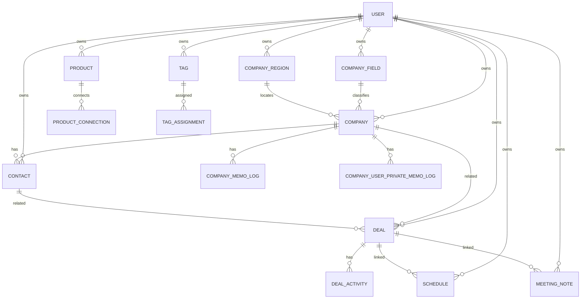

# 데이터 모델 / ERD 초안

> MVP는 명확한 영업 도메인 모델을 사용하되, 태그/메모/metadata/custom field로 확장성을 확보한다.

---

## 0. 현재 구현 상태

현재 `BE/prisma/schema.prisma`와 migration 기준으로 구현된 DB 범위:

- Auth/User: `User`, `UserOAuthAccount`, `AuthDevice`, `AuthSession`
- Company 기본 도메인: `Company`, `CompanyField`, `CompanyRegion`, `CompanyMemoLog`, `CompanyUserPrivateMemoLog`

현재 구현 기준 migration:

- `BE/prisma/migrations/20260611000000_add_company_domain/migration.sql`

아직 DB에 구현되지 않은 계획 범위:

- `Contact`
- `ContactLog`
- `Product`
- `ProductLog`
- `ProductConnection`
- `Deal`
- `DealActivity`
- `Schedule`
- `MeetingNote`
- `Tag`
- `TagAssignment`
- `PersonalMemo`
- `AuditLog`
- `Notification`
- `ImportJob`
- `ExportJob`

이 문서는 제품 관점의 전체 목표 모델을 설명한다. 실제 구현 여부와 컬럼 상세는 `AGENT/SOFTWARE_AGENT/DB_SCHEMA/README.md`와 각 schema 문서를 우선 확인한다.

## 1. 핵심 엔티티

```text
User
  ├─ CompanyField
  ├─ CompanyRegion
  ├─ Company
  │   ├─ CompanyMemoLog
  │   ├─ CompanyUserPrivateMemoLog
  │   └─ Contact
  │       └─ ContactLog
  ├─ Product
  │   └─ ProductLog
  ├─ Deal
  │   └─ DealActivity
  ├─ Schedule
  ├─ MeetingNote
  ├─ Tag
  └─ ImportJob / ExportJob / AuditLog / Notification
```

## 2. 공통 필드 원칙

대부분의 사용자 데이터 테이블은 다음 필드를 가진다.

- id
- userId
- createdAt
- updatedAt
- deletedAt
- metadata

확장 필드는 DB 구조에는 준비하되 MVP UI에서는 숨긴다.

## 3. User

- id
- email
- displayName
- role: USER / ADMIN
- authProvider
- createdAt
- updatedAt

## 4. Company

- id
- userId
- companyName
- companyFieldId
- companyRegionId
- createdAt
- updatedAt

관계:

- Company 1:N Contact
- Company N:1 CompanyField
- Company N:1 CompanyRegion
- Company 1:N CompanyMemoLog
- Company 1:N CompanyUserPrivateMemoLog
- Company N:M Product through ProductConnection
- Company 1:N Deal
- Company 1:N Schedule
- Company 1:N MeetingNote

정책:

- 회사 목록은 `createdAt DESC`로 정렬한다.
- 회사 목록 응답에는 최근 수정일을 포함하지 않는다.
- 회사 단건 응답에는 나중에 거래처 수와 딜 수를 추가할 예정이다.
- 회사 기본 기능에서는 휴지통과 soft delete를 우선 제외한다.
- 회사 생성 요청의 `companyMemo`는 `Company` 테이블에 저장하지 않고 `CompanyMemoLog` 첫 데이터로 저장한다.
- 회사명, 회사분야, 회사지역은 회사 단건 수정 API로 변경할 수 있다.

## 5. CompanyField / CompanyRegion / CompanyMemoLog / CompanyUserPrivateMemoLog

### CompanyField

- id
- userId
- field
- createdAt

목적:

- 회사 분야 필터 옵션을 사용자별로 관리한다.
- 이미 회사에 매핑된 분야는 삭제할 수 없다.
- 수정은 제공하지 않고 생성과 삭제만 제공한다.

### CompanyRegion

- id
- userId
- region
- createdAt

목적:

- 회사 지역 필터 옵션을 사용자별로 관리한다.
- 이미 회사에 매핑된 지역은 삭제할 수 없다.
- 수정은 제공하지 않고 생성과 삭제만 제공한다.

### CompanyMemoLog

- id
- companyId
- userId
- memoType
- memo
- createdAt
- updatedAt

목적:

- 회사 특징에 대한 일반 메모 로그를 저장한다.
- 회사 생성 시 `companyMemo`가 있으면 이 테이블의 첫 데이터로 저장하고 `memoType`은 서버가 `초기 메모`로 저장한다.
- 독립적인 회사 메모 로그 생성 API는 `memoType`, `memo`를 필수로 받는다.

### CompanyUserPrivateMemoLog

- id
- companyId
- userId
- memoCiphertext
- memoKeyVersion
- createdAt
- updatedAt

목적:

- 회사별 사용자 비밀 메모 로그를 저장한다.
- 비밀 메모 원문은 데이터베이스에 평문으로 저장하지 않는다.
- 작성자 본인만 복호화된 `memo`를 볼 수 있고, 관리자도 원문을 볼 수 없다.
- 독립적인 회사 개인 비밀 메모 로그 생성 API는 `memo`만 필수로 받는다.

## 6. Contact

- id
- userId
- companyId nullable
- name
- department
- position
- location nullable
- phone
- email
- metadata
- deletedAt

관계:

- Contact N:1 Company
- Contact N:M Product through ProductConnection
- Contact 1:N Deal
- Contact 1:N ContactLog
- Contact 1:N Schedule
- Contact 1:N MeetingNote

## 7. ContactLog

- id
- userId
- contactId
- logDate
- title
- content
- createdAt
- updatedAt
- deletedAt

목적:

- 거래처에 대해 확인된 객관적 만남/변경/소식/이력 기록

## 8. Product

- id
- userId
- name
- category
- description
- unitPrice nullable
- metadata
- deletedAt

관계:

- Product N:M Company/Contact/Deal through ProductConnection
- Product 1:N ProductLog

## 9. ProductLog

- id
- userId
- productId
- logDate
- title
- content
- createdAt
- updatedAt
- deletedAt

목적:

- 제품에 대해 확인된 객관적 변경/소식/제안/이력 기록

## 10. ProductConnection

제품과 회사/거래처/딜의 연결 의미를 저장한다.

- id
- userId
- productId
- targetType: COMPANY / CONTACT / DEAL
- targetId
- connectionType
- note
- createdAt
- updatedAt
- deletedAt

기본 connectionType:

- INTERESTED
- DELIVERED
- PROPOSED
- COMPETITOR
- MAINTENANCE
- OTHER

## 11. Deal

- id
- userId
- companyId nullable
- contactId nullable
- title
- amount
- currency default KRW
- stage
- likelihoodStatus: POSITIVE / NEUTRAL / NEGATIVE
- likelihoodPercent nullable
- metadata
- deletedAt

기본 stage:

- INITIAL_CONTACT
- IN_DISCUSSION
- WON
- LOST

관계:

- Deal N:1 Company
- Deal N:1 Contact
- Deal N:M Product through ProductConnection
- Deal 1:N DealActivity
- Deal 1:N Schedule
- Deal 1:N MeetingNote nullable

## 12. DealActivity

- id
- userId
- dealId
- activityDate
- typeId
- title
- content
- isAutoGenerated
- metadata
- deletedAt

## 13. DealActivityType

- id
- userId nullable
- name
- isSystem
- createdAt

시스템 기본 타입:

- 기타 기록
- 전화
- 미팅
- 이메일
- 단계변경
- 회의록연결

## 14. Schedule

- id
- userId
- title
- startAt
- endAt
- allDay
- companyId nullable
- contactId nullable
- dealId nullable
- location
- memo
- source: INTERNAL / GOOGLE
- externalCalendarId nullable
- externalEventId nullable
- metadata
- deletedAt

## 15. MeetingNote

- id
- userId
- dealId nullable
- companyId nullable
- contactId nullable
- meetingDate
- companyName
- contactName
- department
- productName
- stageText
- detail
- futurePlan
- requiredAction
- rawInput
- aiOutput
- metadata
- deletedAt

## 16. Tag

- id
- userId
- name
- color
- createdAt
- updatedAt

## 17. TagAssignment

- id
- userId
- tagId
- targetType: COMPANY / CONTACT / PRODUCT / DEAL / SCHEDULE / MEETING_NOTE
- targetId

## 18. PersonalMemo

거래처/제품/딜의 Memo는 각 엔티티의 단일 `memo` 필드가 아니라 Log처럼 여러 건 누적되는 기록형 데이터로 저장한다.

Log는 객관적 사실, 변경, 만남, 소식, 이력 기록이고 Memo는 사용자의 주관적 생각, 판단, 개인 참고 기록이다. Memo 원문은 민감정보 후보로 보고 암호화, Admin masking, 원문 조회 감사 정책을 적용한다.

회사 도메인은 최신 요구사항에 따라 `CompanyMemoLog`와 `CompanyUserPrivateMemoLog`를 별도 사용한다. 따라서 `PersonalMemo`의 회사 target은 현재 회사 기본 기능에 사용하지 않는다.

객관 Log는 `ContactLog`, `ProductLog`, `DealActivity`로 도메인별 분리한다. 사용자 개인 Memo Log는 `PersonalMemo`로 저장하되 `targetType`과 `targetId`로 거래처/제품/딜을 분리한다.

- id
- userId
- targetType: CONTACT / PRODUCT / DEAL
- targetId
- memoDate
- title nullable
- contentCiphertext
- contentKeyVersion
- isSensitive
- createdAt
- updatedAt
- deletedAt

## 19. AuditLog

- id
- actorUserId
- action
- targetType
- targetId
- reason nullable
- metadata
- createdAt

민감 데이터 원문 조회는 반드시 AuditLog를 남긴다.

## 20. Notification

- id
- userId
- type
- channel
- targetType
- targetId
- scheduledAt
- sentAt nullable
- status
- metadata

## 21. ImportJob

- id
- userId
- targetType
- fileName
- status
- aiMapping
- resultSummary
- createdAt
- completedAt nullable

## 22. Mermaid ERD



## 23. 관련 문서

- `AGENT/SOFTWARE_AGENT/DB_SCHEMA/README.md`
- `AGENT/SOFTWARE_AGENT/DB_SCHEMA/AUTH_USER_SCHEMA.md`
- `AGENT/SOFTWARE_AGENT/DB_SCHEMA/COMPANY_SCHEMA.md`
- `AGENT/SOFTWARE_AGENT/BACKEND_AGENT/ARCHITECTURE/BACKEND.md`
